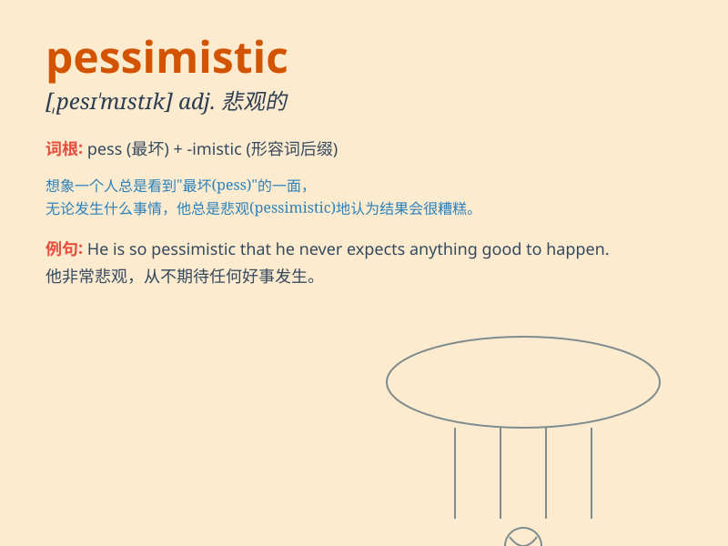

## pessimistic

**英音:** _[,pesɪ\'mɪstɪk]_ **美音:** _[,pɛsɪ\'mɪstɪk]_

**译义:** *adj.悲观的,厌世的*

### 短语

+ **pessimistic view:** _悲观的看法_

+ **pessimistic attitude:** _悲观的态度_

+ **pessimistic outlook:** _悲观的前景_

+ **pessimistic prediction:** _悲观的预测_

+ **pessimistic mood:** _悲观的情绪_

### 例句

#### 例句1

> **He has always been pessimistic about his chances of success.**

**中文翻译:** 他一直对自己成功的机会持悲观态度。

**单词释义:** 悲观的

#### 例句2

> **The pessimistic outlook on the economy is causing concerns among
investors.**

**中文翻译:** 对经济的悲观展望引起了投资者的担忧。

**单词释义:** 悲观的

#### 例句3

> **Despite the challenges, we should not be pessimistic and give up
hope.**

**中文翻译:** 尽管面临挑战，我们不应悲观并放弃希望。

**单词释义:** 悲观的

### 背诵小故事

> A man always saw the dark side of everything. He was pessimistic.
When others saw hope in a situation, he only imagined the worst. This
made him unhappy and lonely. Eventually, he realized he needed to change
his mindset.

**一个男人总是看到事物的阴暗面。他很悲观。当别人在一种情况中看到希望时，他只想象最糟糕的情况。这使他不开心且孤独。最终，他意识到需要改变自己的心态。**

### 图义

