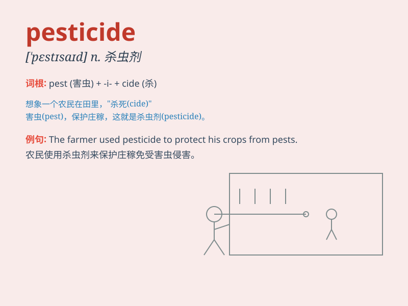

## pesticide

**英音:** _[\'pestɪsaɪd]_ **美音:** _[\'pɛstɪsaɪd]_

**译义:** *n.杀虫剂*

### 短语

+ **pesticide residue:** _农药残留_

+ **pesticide poisoning:** _农药中毒_

+ **chemical pesticide:** _化学农药_

+ **pesticide spray:** _农药喷雾_

+ **organic pesticide:** _有机农药_

### 例句

#### 例句1

> **The excessive use of pesticides can harm the environment.**

**中文翻译:** 过度使用杀虫剂会损害环境。

**单词释义:** 杀虫剂

#### 例句2

> **Farmers need to be cautious when applying pesticides to their
crops.**

**中文翻译:** 农民在给农作物施农药时需要谨慎。

**单词释义:** 农药

#### 例句3

> **The government has strict regulations on the sale and use of
pesticides.**

**中文翻译:** 政府对杀虫剂的销售和使用有严格的规定。

**单词释义:** 杀虫剂

### 背诵小故事

> One day, a farmer was worried about pests destroying his crops. So,
he used a special substance called \'pesticide\' to protect them. The
pesticide killed the pests and saved the harvest.

**有一天，一位农民担心害虫毁坏他的庄稼。于是，他使用了一种叫做"杀虫剂"的特殊物质来保护庄稼。杀虫剂杀死了害虫，拯救了收成。**

### 图义

