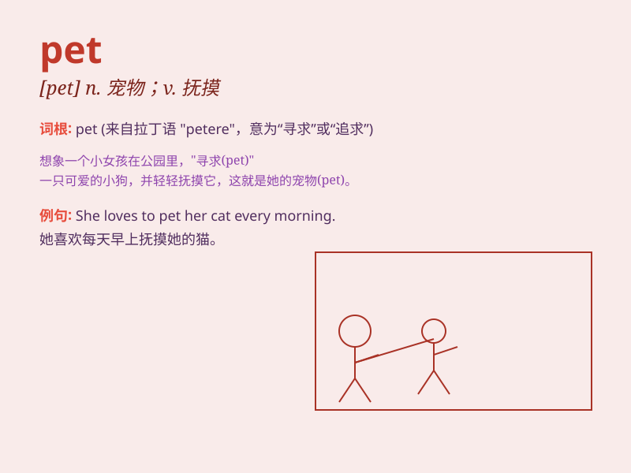

## pet

**英音:** _[pet]_ **美音:** _[pɛt]_

**译义:**
*n.宠物,受宠爱的人,不悦adj.宠爱的,亲昵的vt.宠爱vi.拥抱,爱抚,生气,发脾气*

### 短语

+ **pet dog:** _宠物狗_

+ **pet shop:** _宠物店_

+ **house pet:** _家庭宠物_

+ **pet name:** _爱称；昵称_

+ **keep a pet:** _养宠物_

### 例句

#### 例句1

> **I have a pet dog. It\'s very cute.**

**中文翻译:** 我有一只宠物狗。它非常可爱。

**单词释义:** 宠物

#### 例句2

> **She pets the cat gently.**

**中文翻译:** 她轻轻地抚摸着猫。

**单词释义:** 抚摸

#### 例句3

> **He is the teacher\'s pet.**

**中文翻译:** 他是老师的宠儿。

**单词释义:** 宠儿；宝贝

### 背诵小故事

> One day, I saw a little girl holding a cute puppy. She said, \'This
is my pet. I love to play with it.\' The puppy was so friendly and made
her happy every day.

**有一天，我看到一个小女孩抱着一只可爱的小狗。她说：'这是我的宠物。我喜欢和它一起玩。'这只小狗非常友好，每天都让她很开心。**

### 图义

