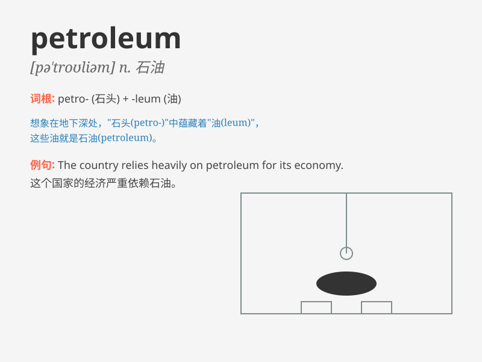

## petroleum

**英音:** _[pə\'trəʊlɪəm]_ **美音:** _[pə\'trolɪəm]_

**译义:** *n.石油*

### 短语

+ **petroleum industry:** _石油工业_

+ **petroleum product:** _石油产品_

+ **petroleum reserve:** _石油储备_

+ **petroleum exploration:** _石油勘探_

+ **petroleum refinery:** _炼油厂_

### 例句

#### 例句1

> **The country is rich in petroleum resources.**

**中文翻译:** 这个国家石油资源丰富。

**单词释义:** 石油

#### 例句2

> **Petroleum is widely used in various industries.**

**中文翻译:** 石油在各个行业被广泛使用。

**单词释义:** 石油

#### 例句3

> **The price of petroleum has fluctuated greatly recently.**

**中文翻译:** 最近石油的价格波动很大。

**单词释义:** 石油

### 背诵小故事

> A brave adventurer was lost in the desert. Just when he was about to
give up, he found a hidden cave filled with barrels labeled
\'petroleum\'. It saved his life. Remember, \'petroleum\' is like a
savior in the desert!

**一位勇敢的探险家在沙漠中迷路了。就在他即将放弃的时候，他发现了一个隐藏的洞穴，里面装满了标有\'石油\'的桶。这救了他的命。记住，\'petroleum\'就像沙漠中的救星！**

### 图义

