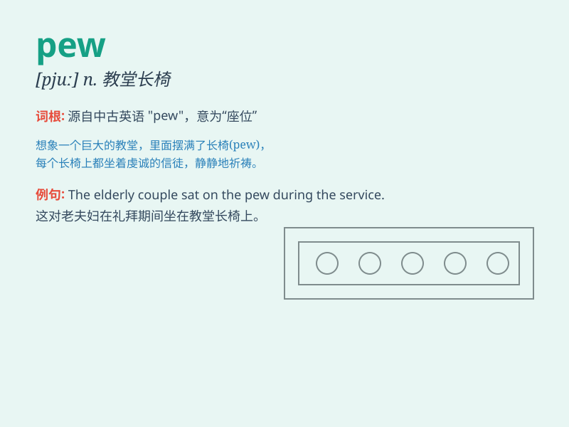

## pew

**英音:** _[pjuː]_ **美音:** _[pju]_

**译义:** *n.教堂内的靠背长凳vt.排座位*

### 短语

+ **pew rent:** _教堂座位租金_

+ **pew fellow:** _教堂座位上的人_

+ **pew opener:** _教堂座位开启器_

+ **pew cushion:** _教堂座位垫_

+ **pew end:** _教堂座位的末端_

### 例句

#### 例句1

> **The church pew was uncomfortable.**

**中文翻译:** 教堂里的长椅坐着不舒服。

**单词释义:** 长椅

#### 例句2

> **She sat quietly in the pew during the service.**

**中文翻译:** 做礼拜时她安静地坐在长椅上。

**单词释义:** 长椅

#### 例句3

> **The old pew creaked as he shifted his weight.**

**中文翻译:** 他变换体重时，那张旧长椅嘎吱作响。

**单词释义:** 长椅

### 背诵小故事

> In the old church, a little girl always sat on the pew. One day, she
dropped her toy on the pew and had to reach down to get it. From then
on, she never forgot the word \'pew\'.

**在古老的教堂里，一个小女孩总是坐在长凳上。有一天，她把玩具掉在了长凳上，不得不弯腰去捡。从那以后，她再也忘不了'pew'这个词。**

### 图义

