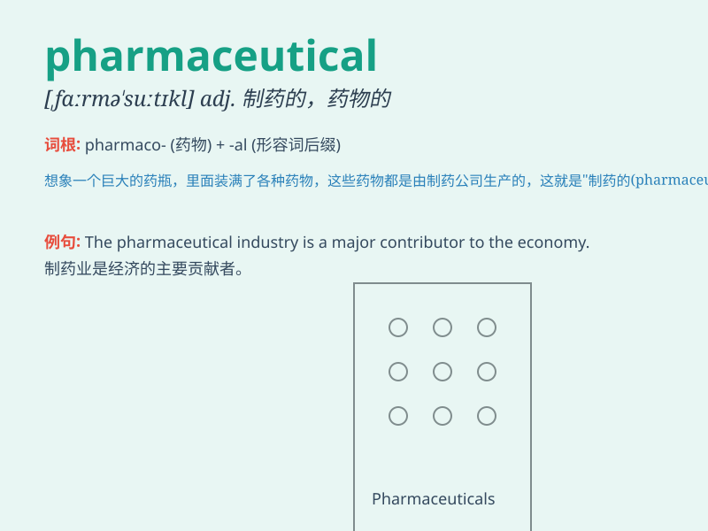

## pharmaceutical

**英音:** _[ˌfɑːməˈsuːtɪkəl]_ **美音:**
_[ˌfɑːr.məˈsuː.tɪ.kəl]_

**译义:** *adj.制药的，药学的；n.药品，药物（常复数形式）*

### 短语

+ **pharmaceutical company:** _制药公司_

+ **pharmaceutical industry:** _制药业_

+ **pharmaceutical product:** _药品_

+ **pharmaceutical research:** _药物研究_

+ **pharmaceutical factory:** _制药厂_

### 例句

#### 例句1

> **The pharmaceutical company is conducting clinical trials for a
new drug.**

**中文翻译:** 这家制药公司正在为一种新药进行临床试验。

**单词释义:** 制药的

#### 例句2

> **He has a degree in pharmaceutical science.**

**中文翻译:** 他拥有制药科学学位。

**单词释义:** 制药的；药品的

#### 例句3

> **The rise in healthcare costs is driven by expensive
pharmaceutical products.**

**中文翻译:** 医疗保健费用的上涨是由昂贵的药品所推动的。

**单词释义:** 药品

### 背诵小故事

>
想象一个神奇的药厂，里面的工人都在忙碌地生产各种药品。这些药品能治疗各种疾病，让人们恢复健康。这个药厂就是\'pharmaceutical\'的世界。

**想象一个药厂，工人生产药品，来辅助记忆\'pharmaceutical\'（制药的；药品）这个单词**

### 图义

