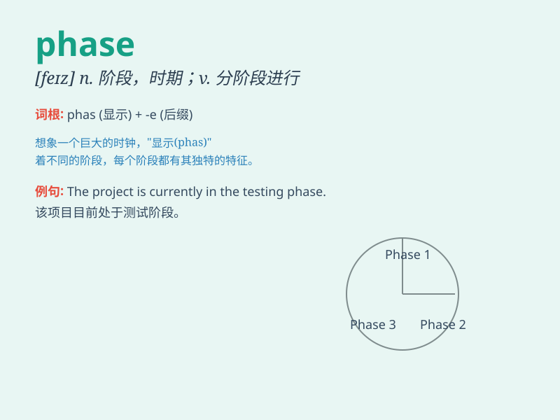

## phase

**英音:** _[feɪz]_ **美音:** _[fez]_

**译义:** *n.阶段,状态,相,相位v.定相*

### 短语

+ **phase in:** _逐步引入；分阶段开始_

+ **phase out:** _逐步淘汰；逐步停止_

+ **liquid phase:** _液相_

+ **solid phase:** _固相_

+ **gas phase:** _气相_

### 例句

#### 例句1

> **The project is currently in the planning phase.**

**中文翻译:** 这个项目目前处于规划阶段。

**单词释义:** 阶段；时期

#### 例句2

> **We need to phase in the new system gradually.**

**中文翻译:** 我们需要逐步引入新系统。

**单词释义:** 逐步引入；分阶段进行

#### 例句3

> **The moon goes through different phases.**

**中文翻译:** 月亮会经历不同的相位。

**单词释义:** 相位；月相

### 背诵小故事

> 想象一下，月亮有不同的
phase（阶段）。从弯弯的月牙到圆圆的满月，就像我们的生活，也有各种阶段。比如学习的阶段，工作的阶段。记住月亮的变化，就能记住
phase 啦。

**想象月亮的不同阶段来记住单词'phase'，表示阶段。**

### 图义

