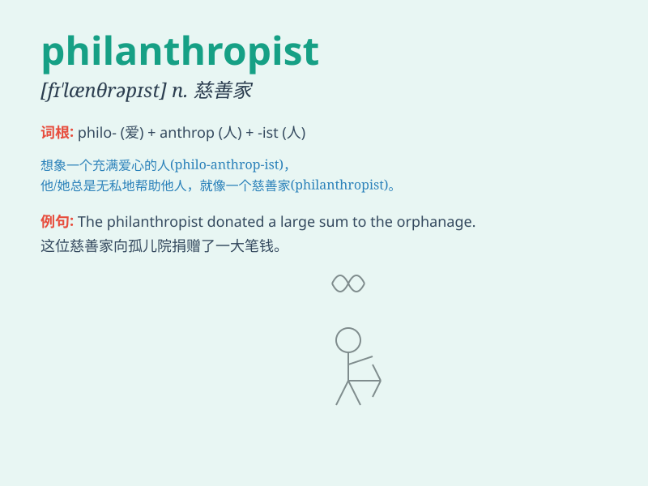

## philanthropist

**英音:** _[fɪ\'lænθrəpɪst]_ **美音:**
_[fɪ\'lænθrəpɪst]_

**译义:** *n.慈善家*

### 短语

+ **Corporate philanthropist:** _企业慈善家_

+ **Well-known philanthropist:** _著名慈善家_

+ **Generous philanthropist:** _慷慨的慈善家_

+ **Local philanthropist:** _当地的慈善家_

+ **Emerging philanthropist:** _新兴慈善家_

### 例句

#### 例句1

> **Bill Gates is widely regarded as a prominent philanthropist,
donating billions to various causes.**

**中文翻译:**
比尔·盖茨被广泛认为是一位杰出的慈善家，向各种事业捐赠了数十亿。

**单词释义:** 慈善家

#### 例句2

> **The philanthropist established a foundation to support education
in underprivileged areas.**

**中文翻译:** 这位慈善家成立了一个基金会来支持贫困地区的教育。

**单词释义:** 慈善家

#### 例句3

> **Many philanthropists contribute to medical research to find cures
for diseases.**

**中文翻译:** 许多慈善家为医学研究做出贡献，以寻找疾病的治疗方法。

**单词释义:** 慈善家

### 背诵小故事

> Once upon a time, there was a rich man. He loved to help others and
spent a lot of money on charities. People called him a philanthropist.
Because he had a big heart and cared about making the world a better
place.

**从前，有一个富人。他喜欢帮助别人，并在慈善事业上花了很多钱。人们称他为慈善家。因为他有一颗宽广的心，关心让世界变得更美好。**

### 图义

