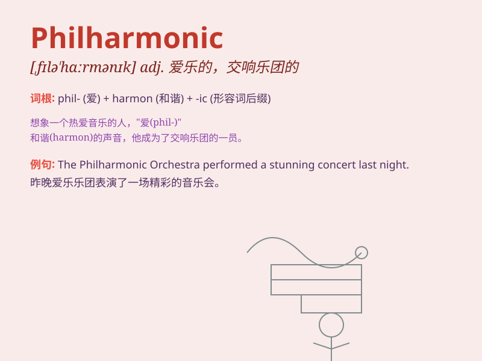

## Philharmonic

**英音:** _[ˌfɪləˈmɒnɪk]_ **美音:** _[ˌfɪləˈmɑːnɪk]_

**译义:** *adj.爱乐的；交响乐团的 n.爱乐者；交响乐团*

### 短语

+ **New York Philharmonic:** _纽约爱乐乐团_

+ **Philharmonic Orchestra:** _爱乐乐团_

+ **London Philharmonic:** _伦敦爱乐乐团_

+ **Philharmonic Society:** _爱乐协会_

+ **Vienna Philharmonic:** _维也纳爱乐乐团_

### 例句

#### 例句1

> **The Philharmonic Orchestra gave a magnificent performance last
night.**

**中文翻译:** 爱乐乐团昨晚进行了一场精彩的演出。

**单词释义:** 爱乐的；爱好音乐的

#### 例句2

> **She is a big fan of the Philharmonic Society.**

**中文翻译:** 她是爱乐协会的忠实粉丝。

**单词释义:** 爱乐的；爱好音乐的

#### 例句3

> **The city\'s Philharmonic Hall is renowned for its excellent
acoustics.**

**中文翻译:** 这座城市的爱乐音乐厅因其出色的音响效果而闻名。

**单词释义:** 爱乐的；爱好音乐的

### 背诵小故事

> A young musician dreamt of joining a famous Philharmonic orchestra.
He practiced hard every day, imagining the glorious stage. Finally, his
dream came true. \'Philharmonic\' means relating to a symphony orchestra
or classical music.

**一位年轻的音乐家梦想加入一个著名的爱乐乐团。他每天刻苦练习，想象着那辉煌的舞台。最终，他的梦想实现了。'Philharmonic'意思是与交响乐团或古典音乐有关。**

### 图义

