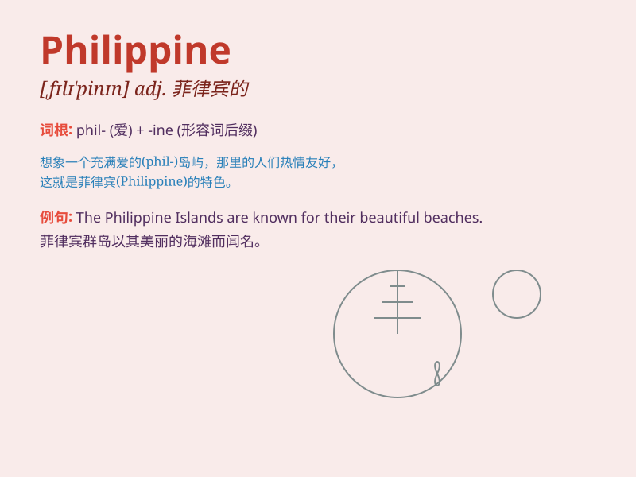

## Philippine

**英音:** _[fɪ\'lɪpɪn]_ **美音:** _[fɪˈlɪpinoʊ]_

**译义:** *n. 菲律宾人；菲律宾语；adj. 菲律宾的；菲律宾人的*

### 短语

+ **Philippine peso:** _菲律宾比索（菲律宾货币）_

+ **Philippine Islands:** _菲律宾群岛_

+ **Philippine Airlines:** _菲律宾航空公司_

+ **Philippine Sea:** _菲律宾海_

+ **Philippine cuisine:** _菲律宾美食_

### 例句

#### 例句1

> **The Philippine government is working on improving the
economy.**

**中文翻译:** 菲律宾政府正在致力于改善经济。

**单词释义:** 菲律宾的；菲律宾人的

#### 例句2

> **She has many friends from the Philippine.**

**中文翻译:** 她有很多来自菲律宾的朋友。

**单词释义:** 菲律宾的

#### 例句3

> **The Philippine culture is very diverse.**

**中文翻译:** 菲律宾文化非常多样化。

**单词释义:** 菲律宾的

### 背诵小故事

>
想象一下，你在菲律宾（Philippine）的海滩上，阳光温暖，海浪轻拍。当地人热情友好，他们用独特的音乐和舞蹈欢迎你。这个美丽的国度充满魅力，让你难以忘怀。

**想象在菲律宾的情景，帮助记住Philippine这个单词，表示菲律宾的、菲律宾人的**

### 图义

