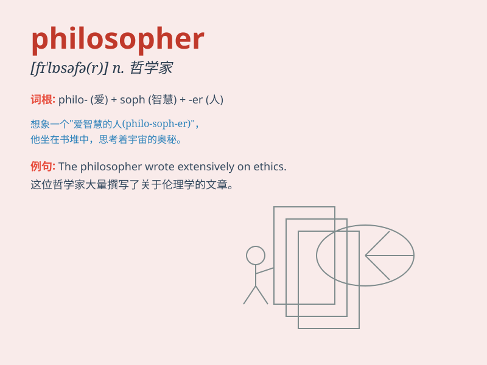

## philosopher

**英音:** _[fɪ\'lɒsəfə]_ **美音:** _[fə\'lɑsəfɚ]_

**译义:** *n.哲学家,哲人*

### 短语

+ **moral philosopher:** _道德哲学家_

+ **ancient philosopher:** _古代哲学家_

+ **philosopher king:** _哲学王_

+ **contemporary philosopher:** _当代哲学家_

+ **famous philosopher:** _著名哲学家_

### 例句

#### 例句1

> **Aristotle was one of the greatest philosophers in history.**

**中文翻译:** 亚里士多德是历史上最伟大的哲学家之一。

**单词释义:** 哲学家

#### 例句2

> **The philosopher spent years contemplating the meaning of
life.**

**中文翻译:** 这位哲学家花了数年时间思考生命的意义。

**单词释义:** 哲学家

#### 例句3

> **She has always been interested in the works of ancient
philosophers.**

**中文翻译:** 她一直对古代哲学家的作品感兴趣。

**单词释义:** 哲学家

### 背诵小故事

> Once upon a time, a wise man named Phil always loved to think deeply
about life and the universe. People called him a philosopher because of
his profound thoughts and wisdom.

**从前，有个叫菲尔的智者总是喜欢深入思考人生和宇宙。由于他深刻的思想和智慧，人们称他为哲学家。**

### 图义

