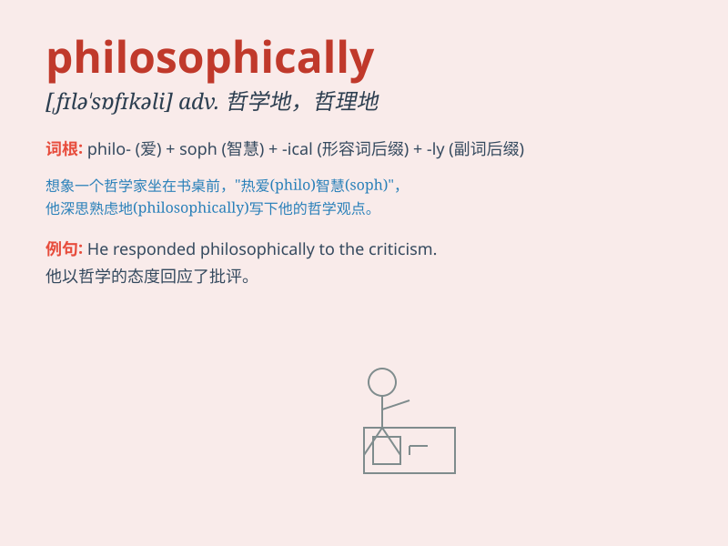

## philosophically

**英音:** _[ˌfɪləˈsɒfɪk(ə)li]_ **美音:**
_[ˌfɪləˈsɑːfɪkli]_

**译义:** *adv.哲学上；哲学地；富于哲理地*

### 短语

+ **philosophically speaking:** _从哲学角度来说_

+ **philosophically inclined:** _有哲学倾向的_

+ **philosophically minded:** _有哲学头脑的_

+ **approach philosophically:** _从哲学角度探讨_

+ **think philosophically:** _进行哲学思考_

### 例句

#### 例句1

> **He approached the problem philosophically, considering all
possible perspectives.**

**中文翻译:** 他从哲学的角度处理这个问题，考虑了所有可能的观点。

**单词释义:** 从哲学的角度

#### 例句2

> **She responded philosophically to the failure, seeing it as a
learning opportunity.**

**中文翻译:** 她以哲学的态度回应失败，将其视为一个学习的机会。

**单词释义:** 以哲学的态度

#### 例句3

> **The scientist viewed the new discovery philosophically,
questioning its implications for human knowledge.**

**中文翻译:**
这位科学家从哲学的角度看待这个新发现，质疑其对人类知识的影响。

**单词释义:** 从哲学的角度

### 背诵小故事

> A wise old man always thought philosophically. When facing
difficulties, he didn\'t panic but analyzed calmly. He believed that
every problem had a solution if seen philosophically. This way of
thinking made him solve many troubles.

**一位智慧的老人总是从哲学的角度思考。面对困难时，他不惊慌，而是冷静分析。他认为，如果从哲学角度看，每个问题都有解决办法。这种思维方式使他解决了许多麻烦。**

### 图义

