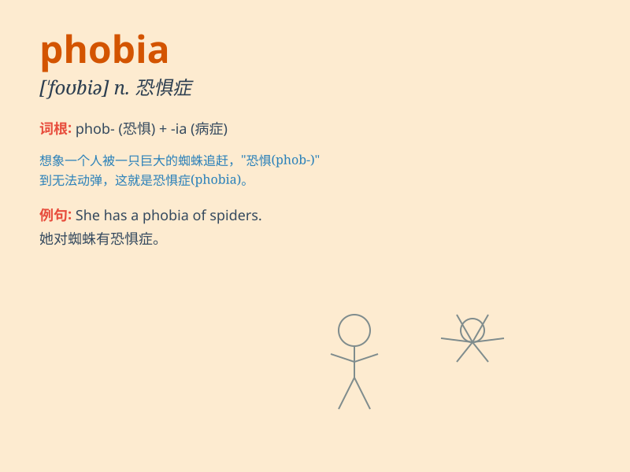

## phobia

**英音:** _[\'fəʊbɪə]_ **美音:** _[\'fobɪə]_

**译义:** *n.恐怖病,恐怖症*

### 短语

+ **social phobia:** _社交恐惧症_

+ **claustrophobia:** _幽闭恐惧症_

+ **acrophobia:** _恐高症_

+ **hydrophobia:** _狂犬病；恐水症_

+ **xenophobia:** _仇外；排外_

### 例句

#### 例句1

> **She has a phobia of spiders.**

**中文翻译:** 她有蜘蛛恐惧症。

**单词释义:** 恐惧症

#### 例句2

> **His phobia of heights prevents him from flying.**

**中文翻译:** 他的恐高症使他无法坐飞机。

**单词释义:** 恐惧症

#### 例句3

> **The doctor diagnosed her with a social phobia.**

**中文翻译:** 医生诊断她患有社交恐惧症。

**单词释义:** 恐惧症

### 背诵小故事

> Once there was a man who had a strong fear of heights. This fear was
so intense that it controlled his life. We call this extreme fear of
heights \'acrophobia\'. The word \'phobia\' means an extreme or
irrational fear.

**曾经有一个人非常恐高。这种恐惧非常强烈，以至于控制了他的生活。我们把这种对高度的极度恐惧称为'恐高症'。单词'phobia'的意思是极度或非理性的恐惧。**

### 图义

