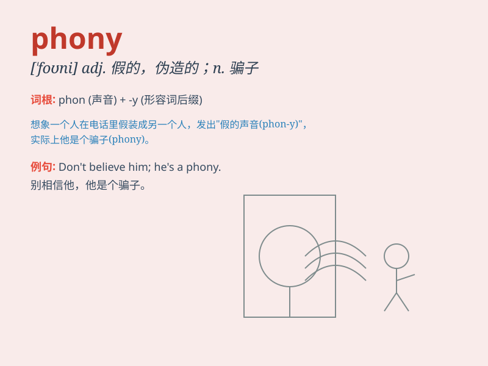

## phony

**英音:** _[\'fəʊnɪ]_ **美音:** _[\'foni]_

**译义:** *adj.假冒的n.假冒者*

### 短语

+ **phony smile:** _假笑_

+ **phony excuse:** _虚假的借口_

+ **phony claim:** _虚假的声明_

+ **phony identity:** _假身份_

+ **phony diploma:** _假文凭_

### 例句

#### 例句1

> **He tried to pass off that phony diamond as a real one.**

**中文翻译:** 他试图把那颗假钻石冒充成真的。

**单词释义:** 假的；伪造的

#### 例句2

> **I could tell from her phony smile that she wasn\'t sincere.**

**中文翻译:** 从她虚假的笑容我能看出她不真诚。

**单词释义:** 虚假的；不真诚的

#### 例句3

> **The phony documents were immediately detected by the
authorities.**

**中文翻译:** 那些伪造的文件马上就被当局察觉了。

**单词释义:** 伪造的；假冒的

### 背诵小故事

> A man claiming to be a rich investor was actually a phony. He showed
fake documents and tricked people. But in the end, his lies were
exposed. Remember, phony means fake or not real.

**一个自称是富有的投资者的男人实际上是个骗子。他出示假文件并欺骗人们。但最终，他的谎言被揭穿了。记住，phony
意思是假的或不真实的。**

### 图义

