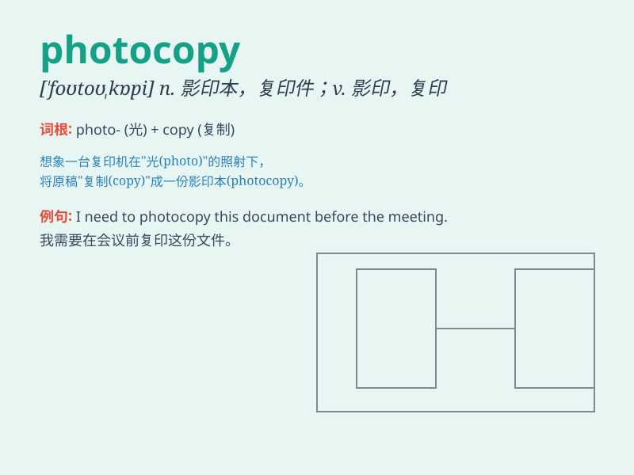

## photocopy

**英音:** _[\'fəʊtəʊkɒpɪ]_ **美音:** _[\'fotokɑpi]_

**译义:** *n.影印v.影印*

### 短语

+ **photocopy machine:** _复印机_

+ **make a photocopy:** _复印一份_

+ **photocopy paper:** _复印纸_

+ **color photocopy:** _彩色复印_

+ **double-sided photocopy:** _双面复印_

### 例句

#### 例句1

> **I need to photocopy these documents for the meeting.**

**中文翻译:** 我需要为会议复印这些文件。

**单词释义:** 复印

#### 例句2

> **Could you please photocopy this report for me?**

**中文翻译:** 你能帮我复印这份报告吗？

**单词释义:** 复印

#### 例句3

> **The library has a photocopy machine for public use.**

**中文翻译:** 图书馆有一台供公众使用的复印机。

**单词释义:** 复印；复印件

### 背诵小故事

> One day, Tom needed to make multiple copies of an important document.
He went to a store and said, \'I want to photocopy this.\' The staff
understood and helped him quickly. So, \'photocopy\' means to make
copies by using light and a special machine.

**有一天，汤姆需要复印一份重要文件。他去了一家店说：'我要复印这个。'工作人员明白了，并很快帮助了他。所以，'photocopy'意思是通过光和特殊机器进行复印。**

### 图义

