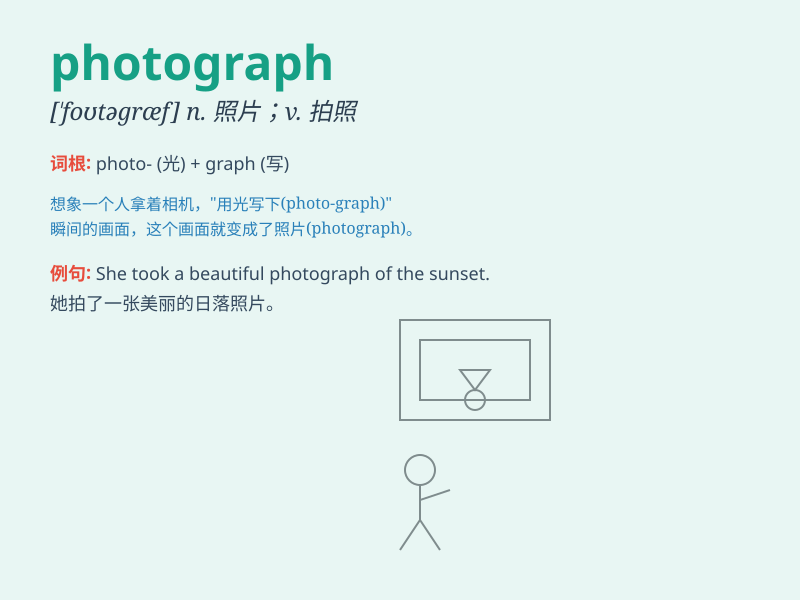

## photograph

**英音:** _[\'fəʊtəgrɑːf]_ **美音:** _[\'fotəɡræf]_

**译义:** *n.照片*

### 短语

+ **take a photograph:** _拍照_

+ **family photograph:** _家庭照片_

+ **wedding photograph:** _结婚照_

+ **passport photograph:** _护照照片_

+ **color photograph:** _彩色照片_

### 例句

#### 例句1

> **I took a photograph of the beautiful sunset.**

**中文翻译:** 我拍了一张美丽日落的照片。

**单词释义:** 照片

#### 例句2

> **The old photograph brought back memories of my childhood.**

**中文翻译:** 这张旧照片唤起了我童年的回忆。

**单词释义:** 照片

#### 例句3

> **She has a collection of rare photographs.**

**中文翻译:** 她有一批珍稀的照片收藏。

**单词释义:** 照片

### 背诵小故事

> A tourist was on a wonderful trip. He wanted to keep the beautiful
scenery in mind forever. So, he took out his camera and clicked. The
result was a photograph, a moment frozen in time.

**一位游客在进行一次美妙的旅行。他想永远记住美丽的风景。于是，他拿出相机按下快门。其结果就是一张照片，一个被定格的瞬间。**

### 图义

