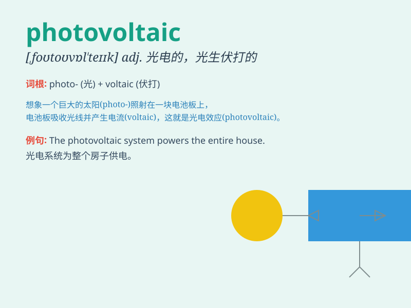

## photovoltaic

**英音:** _[,fəʊtəʊvɒl\'teɪɪk]_ **美音:**
_[,fotovɑl\'teɪk; ,fotovol\'teɪk]_

**译义:** * 光电的*

### 短语

+ **photovoltaic cell:** _光伏电池_

+ **photovoltaic panel:** _光伏板_

+ **photovoltaic array:** _光伏阵列_

+ **photovoltaic module:** _光伏组件_

+ **photovoltaic technology:** _光伏技术_

### 例句

#### 例句1

> **The rooftop is covered with photovoltaic panels to generate
electricity.**

**中文翻译:** 屋顶上覆盖着光伏板来发电。

**单词释义:** 光伏的

#### 例句2

> **Photovoltaic technology has become more efficient and
cost-effective in recent years.**

**中文翻译:** 近年来，光伏技术变得更加高效且更具成本效益。

**单词释义:** 光伏的

#### 例句3

> **The company is investing heavily in photovoltaic research and
development.**

**中文翻译:** 该公司正在大力投资光伏研发。

**单词释义:** 光伏的

### 背诵小故事

>
想象一下，在一个阳光明媚的日子，有个科学家正在研究能把光（photo）直接变成电（voltaic）的神奇材料，这种材料就叫
photovoltaic，它能高效地利用阳光发电。

**想象一下，在阳光充足的一天，一位科学家正在研究一种可以将光直接转化为电的神奇材料，这种材料被称为"光伏的"，它能够高效地利用阳光来产生电能。**

### 图义

