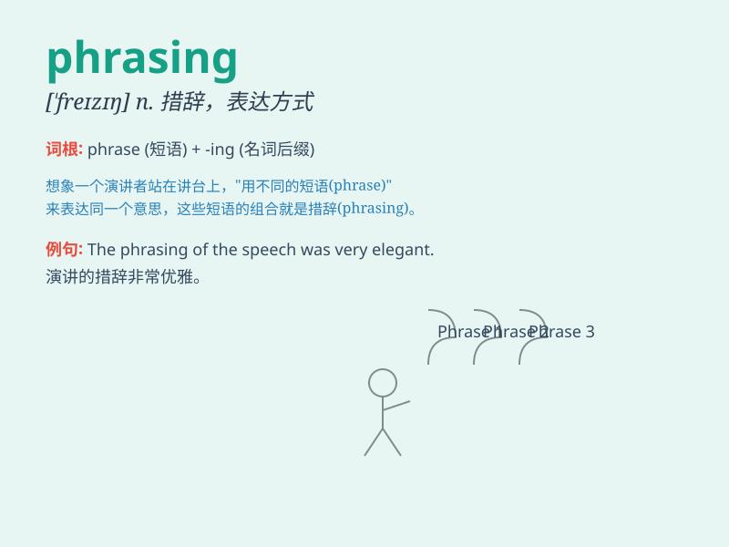

## phrasing

**英音:** _[\'freɪzɪŋ]_ **美音:** _[\'frezɪŋ]_

**译义:** *n.措词*

### 短语

+ **careful phrasing:** _谨慎的措辞_

+ **effective phrasing:** _有效的措辞_

+ **poetic phrasing:** _诗意的措辞_

+ **clumsy phrasing:** _笨拙的措辞_

+ **clear phrasing:** _清晰的措辞_

### 例句

#### 例句1

> **The phrasing of this question is quite confusing.**

**中文翻译:** 这个问题的措辞非常混乱。

**单词释义:** 措辞；表达方式

#### 例句2

> **His excellent phrasing in the speech impressed the audience.**

**中文翻译:** 他演讲中出色的措辞给听众留下了深刻的印象。

**单词释义:** 表达方式；措词

#### 例句3

> **The musician paid great attention to the phrasing of the
melody.**

**中文翻译:** 音乐家非常注重旋律的措辞。

**单词释义:** （音乐、诗歌中的）分句，分段

### 背诵小故事

> A musician was struggling with phrasing in a new song. He practiced
and practiced, finally finding the perfect phrasing that made the song
beautiful. Phrasing is like finding the right rhythm and words to make
music or language flow smoothly.

**一位音乐家在一首新歌的措辞方面遇到了困难。他不断练习，最终找到了完美的措辞，让这首歌变得美妙。措辞就像找到正确的节奏和词语，使音乐或语言流畅。**

### 图义

