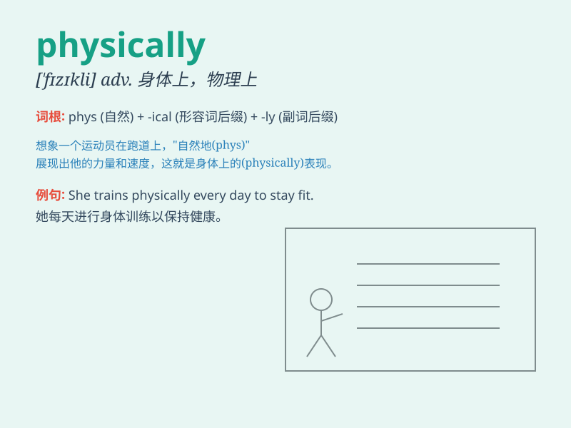

## physically

**英音:** _[\'fɪzɪkəllɪ]_ **美音:** _[\'fɪzɪkli]_

**译义:** *adv.身体上地*

### 短语

+ **physically challenged:** _身体有残疾的_

+ **physically fit:** _身体健康的_

+ **physically impossible:** _物理上不可能的_

+ **physically demanding:** _对体力要求高的_

+ **physically active:** _积极进行体育活动的_

### 例句

#### 例句1

> **He is physically strong and can lift heavy weights easily.**

**中文翻译:** 他身体强壮，能轻松举起重物。

**单词释义:** 身体上；肉体上

#### 例句2

> **The work is physically demanding and requires a lot of
energy.**

**中文翻译:** 这项工作对体力要求很高，需要大量的精力。

**单词释义:** 身体上；体力上

#### 例句3

> **She was physically exhausted after the long hike.**

**中文翻译:** 经过长途徒步旅行，她已经筋疲力尽了。

**单词释义:** 身体上；生理上

### 背诵小故事

> A superhero was always physically strong. He could run fast, jump
high and lift heavy objects easily. His physical abilities helped him
save the world many times.

**一位超级英雄总是身体强壮。他能跑得很快，跳得很高，轻松举起重物。他的身体能力多次帮助他拯救世界。**

### 图义

