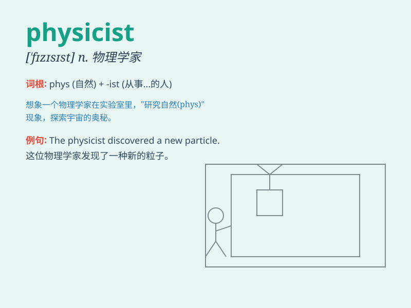

## physicist

**英音:** _[\'fɪzɪsɪst]_ **美音:** _[\'fɪzɪsɪst]_

**译义:** *n.物理学者,唯物论者*

### 短语

+ **particle physicist:** _粒子物理学家_

+ **experimental physicist:** _实验物理学家_

+ **theoretical physicist:** _理论物理学家_

+ **nuclear physicist:** _核物理学家_

+ **astrophysicist:** _天体物理学家_

### 例句

#### 例句1

> **The physicist is conducting an important experiment in the
laboratory.**

**中文翻译:** 物理学家正在实验室进行一项重要的实验。

**单词释义:** 物理学家

#### 例句2

> **She dreams of becoming a renowned physicist one day.**

**中文翻译:** 她梦想有一天成为一名著名的物理学家。

**单词释义:** 物理学家

#### 例句3

> **The physicist\'s theory has attracted widespread attention in the
scientific community.**

**中文翻译:** 这位物理学家的理论引起了科学界的广泛关注。

**单词释义:** 物理学家

### 背诵小故事

> A physicist was lost in a forest. He used his knowledge of physics to
calculate the best way out. With formulas in mind, he finally found the
path. Remember, a physicist studies physics to solve problems!

**一位物理学家在森林里迷路了。他运用物理学知识计算出最佳出路。心中想着公式，他最终找到了路。记住，物理学家研究物理来解决问题！**

### 图义

