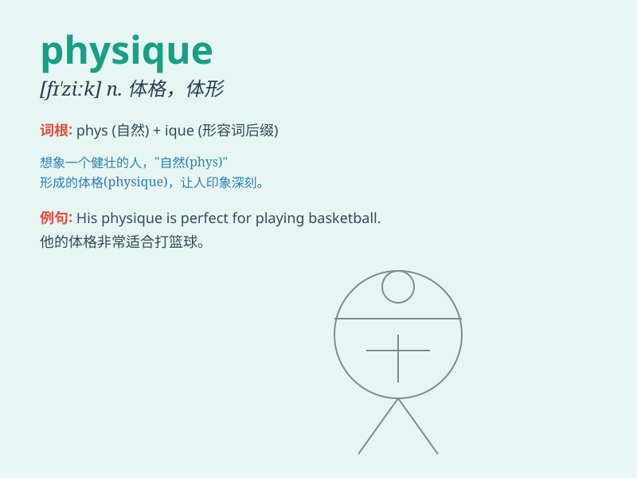

## physique

**英音:** _[fɪ\'ziːk]_ **美音:** _[fɪ\'zik]_

**译义:** *n.(男子的)体格,体形*

### 短语

+ **athletic physique:** _运动员的体格_

+ **robust physique:** _健壮的体格_

+ **slender physique:** _苗条的身材_

+ **muscular physique:** _肌肉发达的体格_

+ **imposing physique:** _威严的体型_

### 例句

#### 例句1

> **He has a powerful physique and is good at sports.**

**中文翻译:** 他体格强健，擅长运动。

**单词释义:** 体格；体形

#### 例句2

> **Her elegant physique makes her stand out in the crowd.**

**中文翻译:** 优雅的身材让她在人群中脱颖而出。

**单词释义:** 身形

#### 例句3

> **Building a good physique requires regular exercise and a balanced
diet.**

**中文翻译:** 塑造良好的体质需要定期锻炼和均衡饮食。

**单词释义:** 体格

### 背诵小故事

> A superhero named Physique was known for his strong and
well-proportioned body. He could lift heavy objects easily and fight
villains with his powerful physique. His appearance made everyone admire
his physical strength and charm.

**一位名叫 Physique
的超级英雄以其强壮且匀称的身体而闻名。他能轻松举起重物，并用他强大的体魄与恶棍战斗。他的出现让每个人都钦佩他的体力和魅力。**

### 图义

