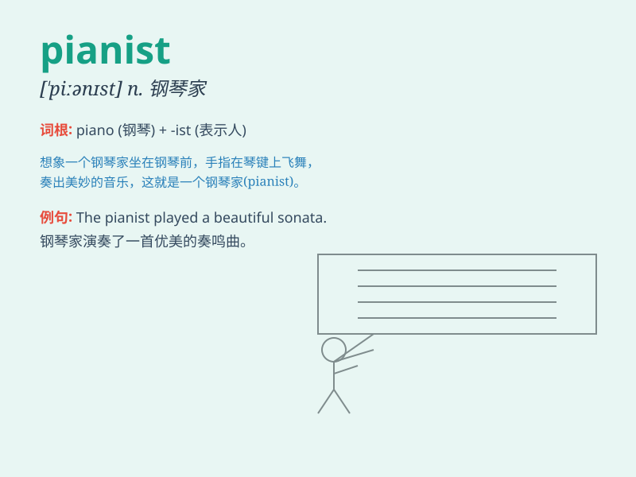

## pianist

**英音:** _[\'pɪənɪst]_ **美音:** _[\'pɪənɪst]_

**译义:** *n.钢琴家,钢琴演奏家*

### 短语

+ **professional pianist:** _职业钢琴家_

+ **accomplished pianist:** _有造诣的钢琴家_

+ **talented pianist:** _有天赋的钢琴家_

+ **renowned pianist:** _著名的钢琴家_

+ **emerging pianist:** _新兴钢琴家_

### 例句

#### 例句1

> **The pianist played a beautiful sonata.**

**中文翻译:** 钢琴家演奏了一首优美的奏鸣曲。

**单词释义:** 钢琴家

#### 例句2

> **She dreams of becoming a famous pianist.**

**中文翻译:** 她梦想成为一名著名的钢琴家。

**单词释义:** 钢琴家

#### 例句3

> **The young pianist impressed the audience with his talent.**

**中文翻译:** 这位年轻的钢琴家以其才华给观众留下了深刻的印象。

**单词释义:** 钢琴家

### 背诵小故事

> A young boy loved music. He practiced the piano every day. Years
passed, and he became an amazing pianist. People were charmed by his
performances. His dream of making beautiful music came true.

**一个小男孩热爱音乐。他每天都练习钢琴。多年过去，他成为了一名出色的钢琴家。人们都被他的演奏所吸引。他演奏美妙音乐的梦想成真了。**

### 图义

