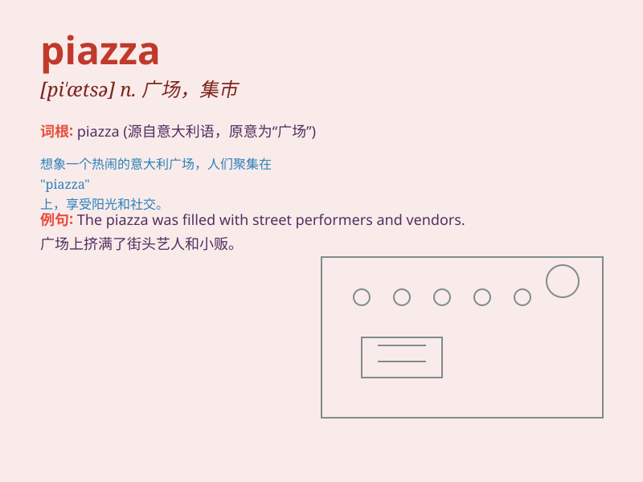

## piazza

**英音:** _[pɪ\'ætsə]_ **美音:** _[pɪ\'ɑzə]_

**译义:** *n.广场,走廊,露天市场*

### 短语

+ **public piazza:** _公共广场_

+ **busy piazza:** _繁忙的广场_

+ **vibrant piazza:** _充满活力的广场_

+ **central piazza:** _中心广场_

+ **historic piazza:** _历史悠久的广场_

### 例句

#### 例句1

> **We met in the piazza in front of the church.**

**中文翻译:** 我们在教堂前的广场见面。

**单词释义:** 广场

#### 例句2

> **The piazza was filled with people enjoying the sunshine.**

**中文翻译:** 广场上挤满了享受阳光的人们。

**单词释义:** 广场

#### 例句3

> **The children were playing in the piazza after school.**

**中文翻译:** 放学后，孩子们在广场上玩耍。

**单词释义:** 广场

### 背诵小故事

> One day, I traveled to Italy and found myself in a beautiful piazza.
There were musicians playing, people chatting and children laughing. It
was a lively and charming place. I\'ll never forget that wonderful
piazza.

**有一天，我去意大利旅行，发现自己身处一个美丽的广场。那里有音乐家在演奏，人们在聊天，孩子们在欢笑。那是一个充满活力和魅力的地方。我永远不会忘记那个美妙的广场。**

### 图义

