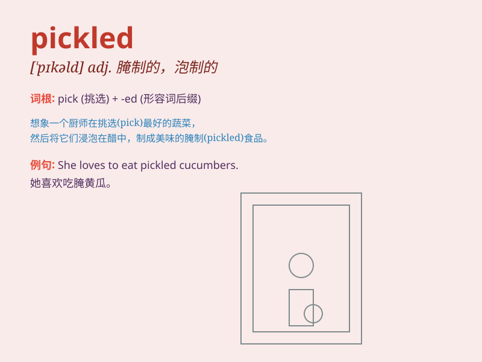

## pickled

**英音:** _[\'pɪk(ə)ld]_ **美音:** _[\'pɪkld]_

**译义:** *adj.烂醉如泥的,盐渍的*

### 短语

+ **pickled cucumber:** _腌黄瓜_

+ **pickled vegetable:** _泡菜；腌菜_

+ **pickled herring:** _腌鲱鱼_

+ **pickled egg:** _腌鸡蛋_

+ **pickled plum:** _腌李子_

### 例句

#### 例句1

> **I love the pickled cucumbers my grandma makes.**

**中文翻译:** 我喜欢奶奶做的腌黄瓜。

**单词释义:** 腌制的；腌渍的

#### 例句2

> **The pickled herring has a strong flavor.**

**中文翻译:** 腌鲱鱼的味道很浓。

**单词释义:** 腌制的；腌渍的

#### 例句3

> **He had some pickled vegetables for lunch.**

**中文翻译:** 他午餐吃了一些腌菜。

**单词释义:** 腌制的；腌渍的

### 背诵小故事

> One day, Tom found some pickled cucumbers in the fridge. They were
preserved in vinegar and salt, giving them a special taste. Tom loved
the pickled cucumbers and decided to have them for lunch.

**一天，汤姆在冰箱里发现了一些腌制的黄瓜。它们用醋和盐保存着，味道很特别。汤姆喜欢这些腌黄瓜，并决定午餐就吃它们。**

### 图义

