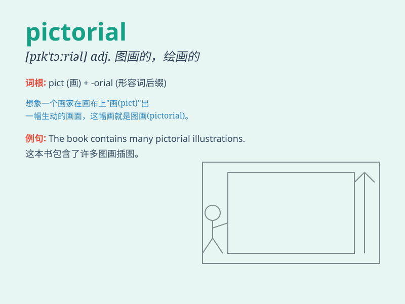

## pictorial

**英音:** _[pɪk\'tɔːrɪəl]_ **美音:** _[pɪk\'tɔrɪəl]_

**译义:** *adj.图示的n.画报*

### 短语

+ **pictorial magazine:** _画刊_

+ **pictorial representation:** _图像表示；图示_

+ **pictorial record:** _图像记录_

+ **pictorial map:** _图画地图_

+ **pictorial design:** _图案设计_

### 例句

#### 例句1

> **The magazine often features pictorial spreads of beautiful
landscapes.**

**中文翻译:** 该杂志经常刊登美丽风景的图片。

**单词释义:** 图片的；用图片表示的

#### 例句2

> **The museum has a rich collection of pictorial art.**

**中文翻译:** 博物馆收藏有丰富的绘画艺术作品。

**单词释义:** 绘画的

#### 例句3

> **The pictorial representation of the data made it easier to
understand.**

**中文翻译:** 数据的图形表示使其更容易理解。

**单词释义:** 图像的；图示的

### 背诵小故事

> A painter was always creating pictorial works. One day, he showed a
beautiful pictorial landscape to the public. Everyone was amazed by the
vivid and charming pictures. Remember, \'pictorial\' means related to
pictures.

**一位画家总是创作图画作品。有一天，他向公众展示了一幅美丽的图画风景。每个人都对生动迷人的画面感到惊讶。记住，\'pictorial\'意思是与图画有关的。**

### 图义

