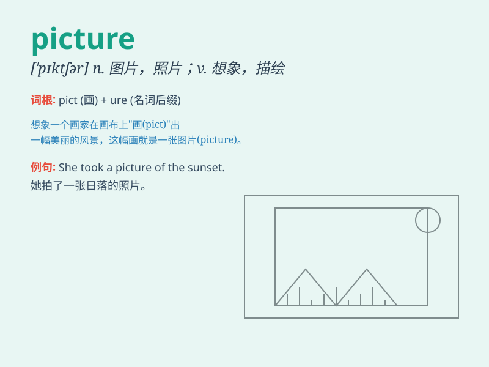

## picture

**英音:** _[\'pɪktʃə]_ **美音:** _[\'pɪktʃɚ]_

**译义:** *n.画,图画,照片,像,美景,描述,相似物,化身vt.画,描绘*

### 短语

+ **take a picture:** _拍照_

+ **in the picture:** _在图片里；在情况中_

+ **out of the picture:** _不在图片里；不相干；不合适_

+ **picture book:** _图画书_

+ **motion picture:** _电影_

### 例句

#### 例句1

> **The picture on the wall is very beautiful.**

**中文翻译:** 墙上的画非常漂亮。

**单词释义:** 画；图画

#### 例句2

> **Can you picture her in that dress?**

**中文翻译:** 你能想象她穿着那件衣服的样子吗？

**单词释义:** 想象；设想

#### 例句3

> **The book gives a detailed picture of life in ancient Rome.**

**中文翻译:** 这本书详细描述了古罗马的生活。

**单词释义:** 描绘；描述

### 背诵小故事

> One day, I went to an art exhibition. There were many wonderful
pictures on the wall. I was deeply attracted by a picture of a beautiful
garden. It was so vivid that I felt like I could step into it.

**有一天，我去了一个艺术展览。墙上有许多精彩的画。我被一幅美丽花园的画深深吸引。它是如此生动，以至于我感觉自己能走进画里。**

### 图义

