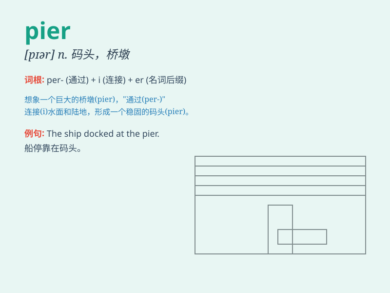

## pier

**英音:** _[pɪə]_ **美音:** _[pɪr]_

**译义:** *n.码头,(桥)墩*

### 短语

+ **fishing pier:** _钓鱼码头_

+ **pier head:** _突码头端部_

+ **pier foundation:** _墩式基础_

+ **jetty pier:** _栈桥码头_

+ **passenger pier:** _客运码头_

### 例句

#### 例句1

> **The fishing boats were moored at the pier.**

**中文翻译:** 渔船停泊在码头。

**单词释义:** 码头

#### 例句2

> **She stood at the end of the pier and watched the waves.**

**中文翻译:** 她站在码头的尽头，看着海浪。

**单词释义:** 码头

#### 例句3

> **The pier jutted out into the sea.**

**中文翻译:** 码头伸入大海。

**单词释义:** 码头

### 背诵小故事

> A man was fishing on the pier. Suddenly, a big wave came and almost
swept him away. But he held onto the pillar of the pier firmly. Later,
he recalled this thrilling experience and always remembered the word
\'pier\'.

**一个男人正在码头上钓鱼。突然，一个大浪袭来，差点把他冲走。但他紧紧抓住码头的柱子。后来，他回忆起这段惊险的经历，总是记住了'pier'这个单词。**

### 图义

