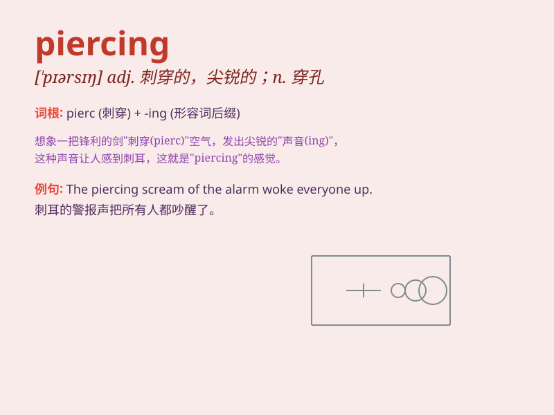

## piercing

**英音:** _[\'pɪəsɪŋ]_ **美音:** _[\'pɪrsɪŋ]_

**译义:** *adj.刺骨的,刺穿的*

### 短语

+ **piercing gaze:** _锐利的目光_

+ **piercing cold:** _刺骨的寒冷_

+ **piercing scream:** _刺耳的尖叫_

+ **piercing pain:** _剧烈的疼痛_

+ **piercing wind:** _凛冽的风_

### 例句

#### 例句1

> **She has a piercing scream that can be heard from miles away.**

**中文翻译:** 她发出刺耳的尖叫声，几英里外都能听到。

**单词释义:** 刺耳的

#### 例句2

> **The piercing wind made it difficult to walk outside.**

**中文翻译:** 凛冽的寒风使人很难走出去。

**单词释义:** 刺骨的

#### 例句3

> **He gave her a piercing look that seemed to see right through
her.**

**中文翻译:** 他用一种锐利的眼神看着她，仿佛要把她看穿。

**单词释义:** 锐利的

### 背诵小故事

> One day, a thief was trying to break into a house. Suddenly, a
piercing alarm went off and scared the thief away. The piercing sound
was so sharp and loud that it could be heard from far away.

**有一天，一个小偷正试图闯入一间房子。突然，一阵刺耳的警报声响起，把小偷吓跑了。这刺耳的声音又尖又响，从很远的地方都能听到。**

### 图义

