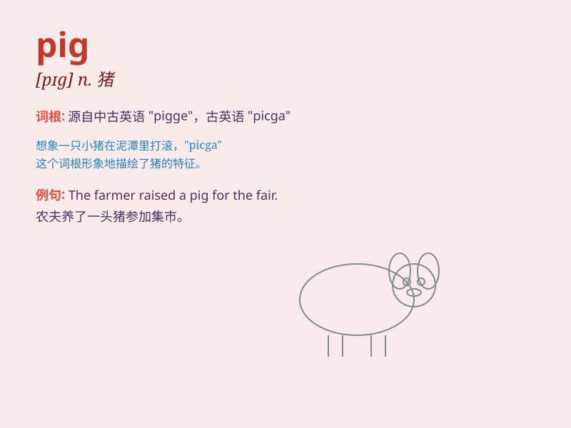

## pig

**英音:** _[pɪg]_ **美音:** _[pɪɡ]_

**译义:** *n.猪,猪肉,贪婪的人v.生小猪,贪婪地吃*

### 短语

+ **pig out:** _狼吞虎咽地大吃_

+ **make a pig of oneself:** _大吃大喝；吃得过多_

+ **pig iron:** _生铁_

+ **guinea pig:** _豚鼠；实验对象；供实验用的人或物_

+ **piggy bank:** _存钱罐_

### 例句

#### 例句1

> **The farmer has many pigs on his farm.**

**中文翻译:** 这位农民的农场里有很多猪。

**单词释义:** 猪（复数形式）

#### 例句2

> **He called her a pig when they argued.**

**中文翻译:** 当他们吵架时，他骂她是猪。

**单词释义:** 猪（比喻粗野或肮脏的人）

#### 例句3

> **The little girl drew a cute pig on the paper.**

**中文翻译:** 小女孩在纸上画了一只可爱的小猪。

**单词释义:** 猪（单数形式）

### 背诵小故事

> Once upon a time, there was a cute little pig. It had a curly tail
and always rolled in the mud. One day, it found a big apple and happily
ate it. The pig was so funny and made everyone laugh.

**从前，有一只可爱的小猪。它有一条卷曲的尾巴，总是在泥里打滚。有一天，它找到了一个大苹果，开心地吃了起来。这只小猪太有趣了，让每个人都笑了。**

### 图义

