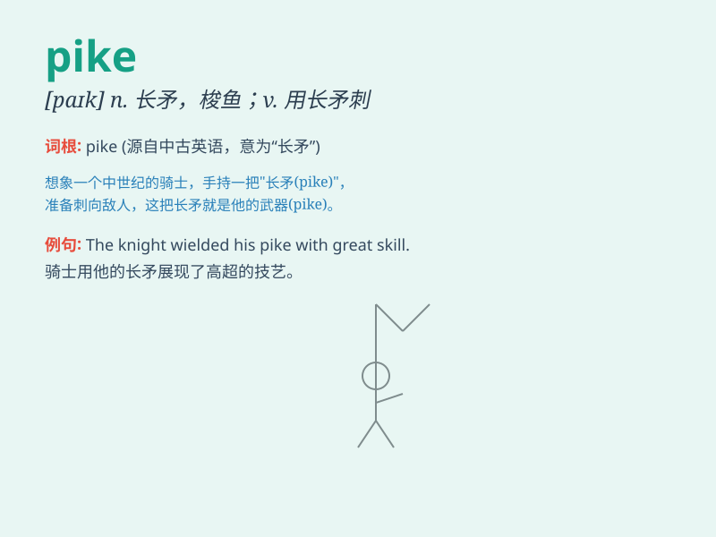

## pike

**英音:** _[paɪk]_ **美音:** _[paɪk]_

**译义:** *n.矛,长枪,梭子鱼vt.用矛刺穿*

### 短语

+ **pike position:** _屈体姿势_

+ **pike eel:** _海鳗_

+ **pike nose:** _尖鼻子_

+ **pike up:** _捡起；拾起_

+ **pike along:** _疾驰；飞奔_

### 例句

#### 例句1

> **The pike is a predatory fish.**

**中文翻译:** 梭子鱼是一种掠食性鱼类。

**单词释义:** 梭子鱼

#### 例句2

> **He climbed the pike to reach the top of the mountain.**

**中文翻译:** 他爬上长矛到达山顶。

**单词释义:** 尖峰；尖头

#### 例句3

> **The road turns into a narrow pike after the bridge.**

**中文翻译:** 过了桥，路就变成了一条狭窄的长矛。

**单词释义:** 通道；道路

### 背诵小故事

> A brave knight was on a journey. He came across a narrow path blocked
by a huge pike. The pike was sharp and dangerous. But the knight was
determined and finally moved the pike aside to continue his adventure.

**一位勇敢的骑士正在旅途中。他遇到一条狭窄的道路被一根巨大的长矛挡住了。这根长矛锋利且危险。但骑士下定决心，最终把长矛移到一边继续他的冒险。**

### 图义

