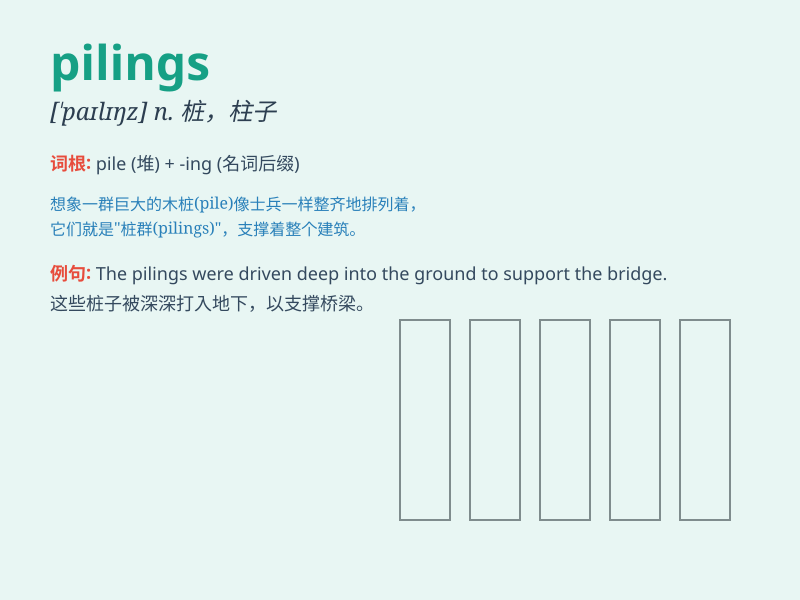

## pilings

**英音:** _[\'paɪlɪŋz]_ **美音:** _[\'paɪlɪŋz]_

**译义:** *n.桩,堆,大量的东西,木桩,桩基*

### 短语

+ **wooden pilings:** _木桩_

+ **concrete pilings:** _混凝土桩_

+ **steel pilings:** _钢桩_

+ **pile driving pilings:** _打桩_

+ **underwater pilings:** _水下桩_

### 例句

#### 例句1

> **The pilings of the old pier were rotten and needed to be
replaced.**

**中文翻译:** 旧码头的桩子腐烂了，需要更换。

**单词释义:** 桩子

#### 例句2

> **The construction workers were busy driving pilings into the
ground.**

**中文翻译:** 建筑工人正忙着把桩打进地里。

**单词释义:** 桩

#### 例句3

> **The pilings supported the weight of the entire building.**

**中文翻译:** 这些桩支撑着整座建筑的重量。

**单词释义:** 桩；柱

### 背诵小故事

> A group of workers were building a pier. They were hammering the
pilings deep into the seabed. The pilings were like strong pillars,
holding up the structure. With the pilings in place, the pier would be
stable and safe.

**一群工人正在建造一个码头。他们将桩柱深深地打入海床。这些桩柱就像坚固的柱子，支撑着整个结构。有了这些桩柱在适当的位置，码头将会稳固又安全。**

### 图义

