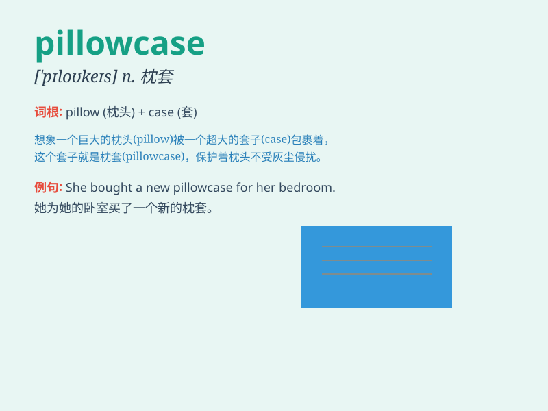

## pillowcase

**英音:** _[\'pɪləʊkeɪs]_ **美音:** _[\'pɪlokes]_

**译义:** *n.枕头套*

### 短语

+ **embroidered pillowcase:** _绣花枕套_

+ **silk pillowcase:** _丝绸枕套_

+ **cotton pillowcase:** _棉质枕套_

+ **printed pillowcase:** _印花枕套_

+ **plain pillowcase:** _素色枕套_

### 例句

#### 例句1

> **I need to change the pillowcase because it\'s stained.**

**中文翻译:** 我需要更换枕套，因为它被弄脏了。

**单词释义:** 枕套

#### 例句2

> **The pillowcase is made of silk and feels very smooth.**

**中文翻译:** 枕套是丝绸材质的，摸起来非常光滑。

**单词释义:** 枕套

#### 例句3

> **She embroidered her initials on the pillowcase as a personal
touch.**

**中文翻译:** 她将自己名字的首字母绣在枕套上，以体现个人风格。

**单词释义:** 枕套

### 背诵小故事

> One night, I had a strange dream. I saw a magical pillowcase that
could talk. It told me its name was \'pillowcase\' and its job was to
protect the pillow. When I woke up, I never forgot the word
\'pillowcase\'.

**一天晚上，我做了一个奇怪的梦。我看到一个会说话的神奇枕套，它告诉我它叫"pillowcase"，它的工作是保护枕头。当我醒来时，我永远不会忘记"pillowcase"这个词。**

### 图义

