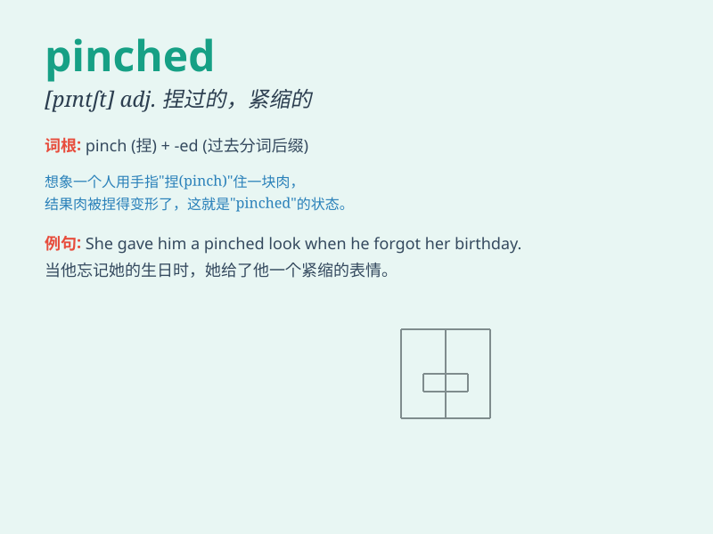

## pinched

**英音:** _[pɪntʃt]_ **美音:** _[pɪntʃt]_

**译义:** *adj. 捏紧的；短缺的；困苦的；v. 捏；夹痛；使困苦（pinch
的过去式和过去分词）*

### 短语

+ **pinched nerve:** _神经受压_

+ **pinched face:** _憔悴的脸_

+ **pinched pennies:** _精打细算；吝啬_

+ **feel pinched:** _感到手头拮据_

+ **pinched look:** _愁眉苦脸；痛苦的表情_

### 例句

#### 例句1

> **She pinched her fingers in the door.**

**中文翻译:** 她的手指被门夹了。

**单词释义:** 夹，捏

#### 例句2

> **The child pinched a piece of cake from the plate.**

**中文翻译:** 这孩子从盘子里偷拿了一块蛋糕。

**单词释义:** 偷拿，窃取

#### 例句3

> **His face looked pinched and tired.**

**中文翻译:** 他的面容看上去憔悴又疲惫。

**单词释义:** （使）收缩，皱缩

### 背诵小故事

> A thief was trying to steal a precious gem, but when he touched it,
an alarm went off and security guards caught him. His face looked
pinched as he was in big trouble.

**一个小偷试图偷一颗珍贵的宝石，但当他碰到它时，警报响了，保安抓住了他。他的脸看起来很憔悴，因为他陷入了大麻烦。**

### 图义

