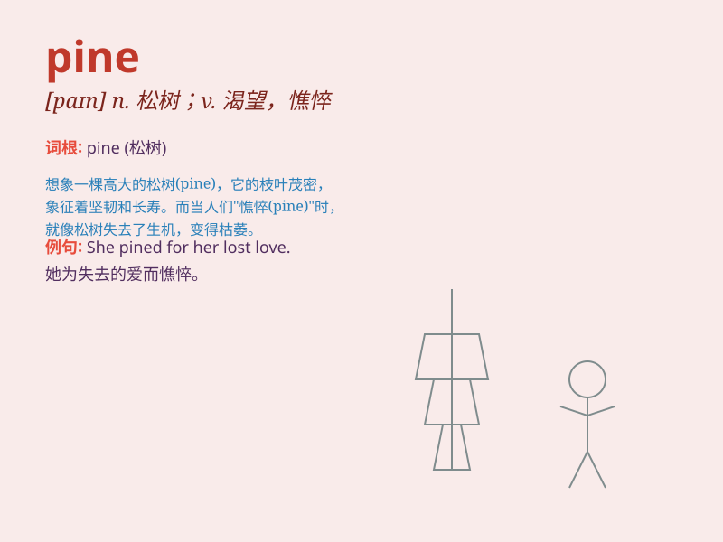

## pine

**英音:** _[paɪn]_ **美音:** _[paɪn]_

**译义:** *n.松树,树木v.消瘦,憔悴,渴望,渴慕*

### 短语

+ **pine away:** _因思念等而消瘦；憔悴_

+ **pine for:** _渴望；思念_

+ **pine tree:** _松树_

+ **pine cone:** _松果；松球_

+ **white pine:** _北美白松_

### 例句

#### 例句1

> **She pined for her lost love.**

**中文翻译:** 她怀念失去的爱情。

**单词释义:** 渴望，思念

#### 例句2

> **The pine tree remained green throughout the winter.**

**中文翻译:** 整个冬天，松树都保持着绿色。

**单词释义:** 松树

#### 例句3

> **He seemed to pine away after his wife\'s death.**

**中文翻译:** 妻子去世后，他似乎变得憔悴了。

**单词释义:** （因忧伤等）消瘦，衰弱

### 背诵小故事

> A little squirrel was lost in the forest. It pined for its home and
friends. It climbed up a pine tree, hoping to find the way back.
Finally, it succeeded and felt happy.

**一只小松鼠在森林里迷路了。它渴望着自己的家和朋友。它爬上了一棵松树，希望能找到回去的路。最后，它成功了，感到很开心。**

### 图义

