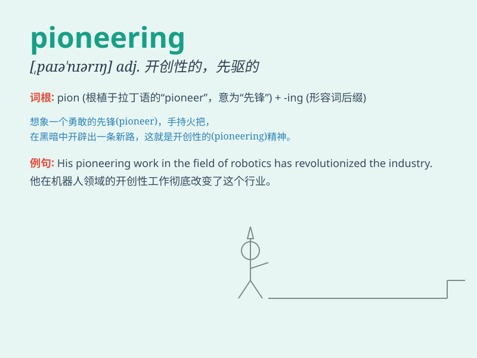

## pioneering

**英音:** _[ˌpaɪ.oˈnɪər.ɪŋ]_ **美音:** _[ˌpaɪ.əˈnɪr.ɪŋ]_

**译义:** *adj. 先驱的；开创性的；先锋的

n\. 先驱者；开拓者；创新者

*

### 短语

+ **pioneering spirit:** _开拓精神；首创精神_

+ **pioneering work:** _开创性工作_

+ **pioneering technology:** _开创性技术；先驱技术_

+ **pioneering effort:** _开创性的努力_

+ **pioneering enterprise:** _创业企业；先驱企业_

### 例句

#### 例句1

> **The company is known for its pioneering work in the field of
technology.**

**中文翻译:** 这家公司因其在技术领域的开创性工作而闻名。

**单词释义:** 开创性的

#### 例句2

> **She made a pioneering contribution to the study of ancient
cultures.**

**中文翻译:** 她对古代文化的研究做出了开创性的贡献。

**单词释义:** 开创性的

#### 例句3

> **The scientist\'s pioneering research has opened up new avenues of
treatment for the disease.**

**中文翻译:** 这位科学家的开创性研究为这种疾病开辟了新的治疗途径。

**单词释义:** 开创性的

### 背诵小故事

> A group of brave scientists were on a pioneering journey. They faced
many difficulties but never gave up. Their pioneering spirit led them to
make great discoveries.

**一群勇敢的科学家正在进行开创性的旅程。他们面临许多困难，但从未放弃。他们的开拓精神引领他们取得了巨大的发现。**

### 图义

