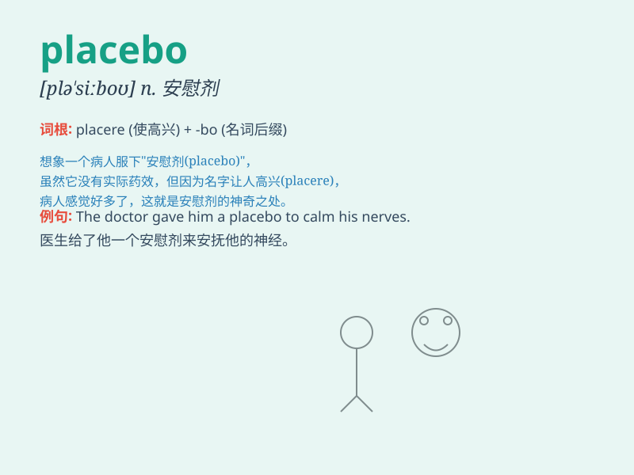

## placebo

**英音:** _[plə\'siːbəʊ]_ **美音:** _[plə\'sibo]_

**译义:** *n.为死者所诵的晚祷词,安慰剂*

### 短语

+ **placebo effect:** _安慰剂效应_

+ **placebo control:** _安慰剂对照_

+ **placebo response:** _安慰剂反应_

+ **placebo treatment:** _安慰剂治疗_

+ **double-blind placebo:** _双盲安慰剂_

### 例句

#### 例句1

> **The new drug was tested against a placebo in the clinical
trial.**

**中文翻译:** 在临床试验中，这种新药与安慰剂进行了对比测试。

**单词释义:** 安慰剂

#### 例句2

> **The patients were divided into two groups, one receiving the
actual medicine and the other given a placebo.**

**中文翻译:**
患者被分为两组，一组接受实际药物治疗，另一组服用安慰剂。

**单词释义:** 安慰剂

#### 例句3

> **The placebo effect can sometimes have a significant impact on a
person\'s perceived health.**

**中文翻译:** 安慰剂效应有时会对一个人感知到的健康状况产生重大影响。

**单词释义:** 安慰剂

### 背诵小故事

> A patient was very ill. The doctor gave him a placebo, telling him it
was a powerful medicine. Surprisingly, he felt better just because he
believed in it. The placebo shows the power of belief.

**一位病人病得很重。医生给他开了安慰剂，告诉他这是强效药。令人惊讶的是，仅仅因为他相信，他感觉好多了。安慰剂显示了信念的力量。**

### 图义

