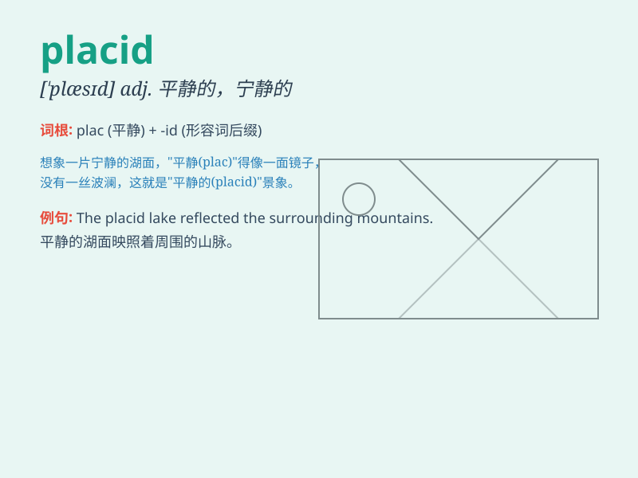

## placid

**英音:** _[\'plæsɪd]_ **美音:** _[\'plæsɪd]_

**译义:** *adj.平静的*

### 短语

+ **placid lake:** _平静的湖_

+ **placid nature:** _温和的性格_

+ **placid smile:** _安详的微笑_

+ **placid mind:** _平和的心态_

+ **placid countryside:** _宁静的乡村_

### 例句

#### 例句1

> **The placid lake reflected the mountains beautifully.**

**中文翻译:** 平静的湖水美丽地映出了群山。

**单词释义:** 平静的

#### 例句2

> **She has a placid personality and never gets angry easily.**

**中文翻译:** 她性格温和，从不轻易生气。

**单词释义:** 温和的

#### 例句3

> **The placid countryside provided a peaceful escape from the
city.**

**中文翻译:** 宁静的乡村为人们提供了一个远离城市的平和去处。

**单词释义:** 宁静的

### 背诵小故事

> A placid lake was surrounded by peaceful mountains. A little girl
rowed a boat on it, enjoying the calm and stillness. The scene was so
placid that it made her forget all her troubles.

**一个平静的湖被宁静的山峦环绕。一个小女孩在湖上划船，享受着这份安宁与平静。这场景如此宁静，让她忘却了所有烦恼。**

### 图义

