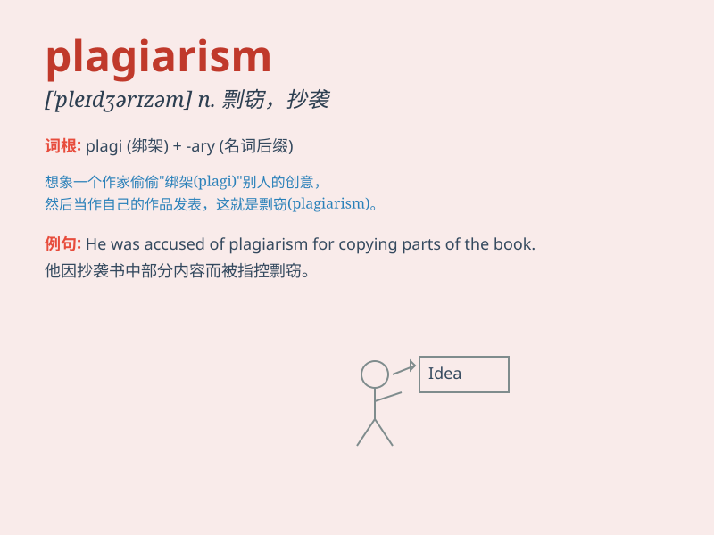

## plagiarism

**英音:** _[\'pleɪdʒərɪz(ə)m]_ **美音:**
_[\'pledʒə\'rɪzəm]_

**译义:** *n.剽窃,剽窃物*

### 短语

+ **academic plagiarism:** _学术抄袭_

+ **plagiarism detection:** _抄袭检测_

+ **prevent plagiarism:** _防止抄袭_

+ **accusation of plagiarism:** _抄袭指控_

+ **serious plagiarism:** _严重的抄袭_

### 例句

#### 例句1

> **The professor punished the student for plagiarism in the term
paper.**

**中文翻译:** 教授惩罚了这位学生在学期论文中的抄袭行为。

**单词释义:** 抄袭行为

#### 例句2

> **Plagiarism is a serious offense in the academic world.**

**中文翻译:** 在学术界，抄袭是一种严重的过错。

**单词释义:** 抄袭；剽窃

#### 例句3

> **The author was accused of plagiarism and lost his reputation.**

**中文翻译:** 这位作者被指控抄袭并失去了声誉。

**单词释义:** 抄袭；剽窃

### 背诵小故事

> A student named Tom was accused of plagiarism. He copied others\'
work in the exam and got a zero. This made him realize that plagiarism
is a serious mistake and will lead to bad consequences.

**一个叫汤姆的学生被指控抄袭。他在考试中抄袭他人的作业得了零分。这让他意识到抄袭是一个严重的错误，会导致不良后果。**

### 图义

