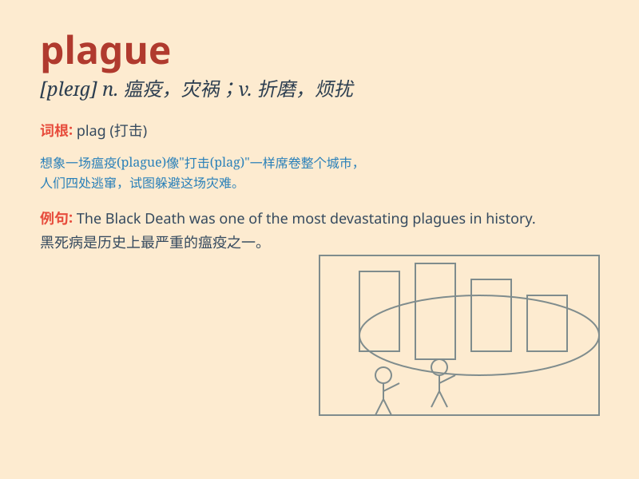

## plague

**英音:** _[pleɪg]_ **美音:** _[pleg]_

**译义:** *n.瘟疫,麻烦,苦恼,灾祸vt.折磨,使苦恼,使得灾祸*

### 短语

+ **bubonic plague:** _腺鼠疫_

+ **plague spot:** _瘟疫区；疫病斑点_

+ **be plagued by:** _被\...\...困扰；受\...\...折磨_

+ **plague of locusts:** _蝗灾_

+ **the great plague:** _大瘟疫_

### 例句

#### 例句1

> **The city was plagued by a series of violent crimes.**

**中文翻译:** 这座城市受到一系列暴力犯罪的困扰。

**单词释义:** 困扰；折磨

#### 例句2

> **A flu plague swept through the school last month.**

**中文翻译:** 上个月一场流感在学校蔓延。

**单词释义:** （疾病）大规模流行；蔓延

#### 例句3

> **He has been plagued with health problems for years.**

**中文翻译:** 他多年来一直受健康问题的困扰。

**单词释义:** 困扰；烦扰

### 背诵小故事

>
在一个古老的小镇，一场可怕的瘟疫（plague）突然爆发。人们纷纷生病，医生们日夜忙碌。勇敢的骑士决定寻找解药，最终拯救了小镇。记住这个故事，就记住了plague这个表示瘟疫、灾祸的单词。

**在一个古老的小镇，一场可怕的瘟疫突然爆发。人们纷纷生病，医生们日夜忙碌。勇敢的骑士决定寻找解药，最终拯救了小镇。记住这个故事，就记住了表示瘟疫、灾祸的plague这个单词。**

### 图义

