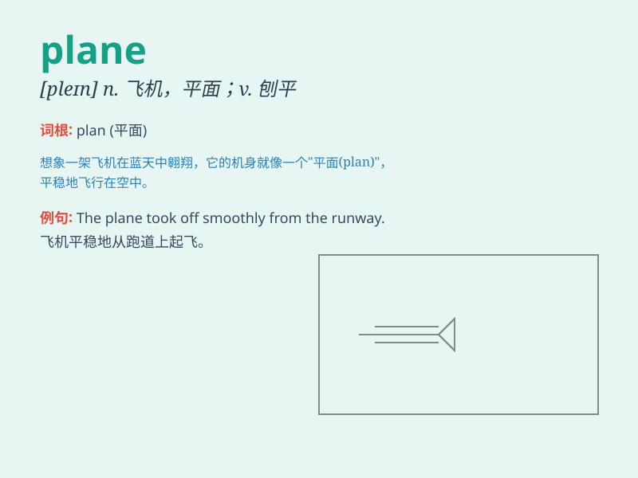

## plane

**英音:** _[pleɪn]_ **美音:** _[plen]_

**译义:** *n.平面,飞机,水平,程度,刨adj.平的,平面的v.刨,刨平*

### 短语

+ **by plane:** _乘飞机_

+ **plane ticket:** _飞机票_

+ **fighter plane:** _战斗机_

+ **passenger plane:** _客机_

+ **model plane:** _模型飞机_

### 例句

#### 例句1

> **The plane took off smoothly.**

**中文翻译:** 这架飞机平稳起飞了。

**单词释义:** 飞机

#### 例句2

> **She used a plane to smooth the wood.**

**中文翻译:** 她用刨子把木头刨平。

**单词释义:** 刨子

#### 例句3

> **The equation describes a plane in three-dimensional space.**

**中文翻译:** 这个方程描述了三维空间中的一个平面。

**单词释义:** 平面

### 背诵小故事

> One day, a little boy was playing in the park. Suddenly, a plane flew
across the sky. The boy looked up excitedly and shouted, \'Look, a
plane!\' The plane was so big and fast.

**一天，一个小男孩在公园里玩耍。突然，一架飞机飞过天空。男孩兴奋地抬头喊道："看，一架飞机！"这架飞机又大又快。**

### 图义

