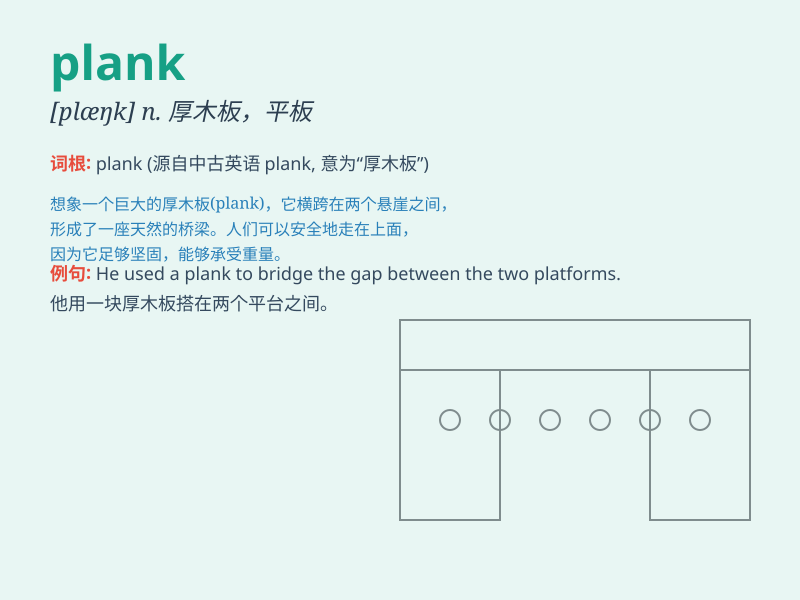

## plank

**英音:** _[plæŋk]_ **美音:** _[plæŋk]_

**译义:**
*n.厚木板,支架,(政党的)政纲条款vt.铺板,立刻付款vi.睡在板上*

### 短语

+ **plank bed:** _木板床_

+ **plank down:** _重重放下；立即付款_

+ **plank road:** _木板路_

+ **saw a plank:** _锯木板_

+ **walk the plank:** _（海盗等逼迫俘虏）走跳板（跳入海中）_

### 例句

#### 例句1

> **He walked along the plank carefully.**

**中文翻译:** 他小心地沿着木板走。

**单词释义:** 木板

#### 例句2

> **The workers carried the planks to the construction site.**

**中文翻译:** 工人们把木板搬到了建筑工地。

**单词释义:** 木板

#### 例句3

> **She used a plank as a makeshift table.**

**中文翻译:** 她用一块木板当作临时桌子。

**单词释义:** 木板

### 背诵小故事

> A man was doing a plank exercise on the beach. Suddenly, a strong
wind blew and he fell onto a wooden plank. The plank was long and thick,
just like the position he was holding. From then on, he always
remembered the word \'plank\' for this funny experience.

**一个男人正在沙滩上做平板支撑练习。突然，一阵强风吹来，他摔倒在一块木板上。这块木板又长又厚，就像他支撑的姿势。从那以后，因为这次有趣的经历，他总是记住了'plank'这个单词。**

### 图义

