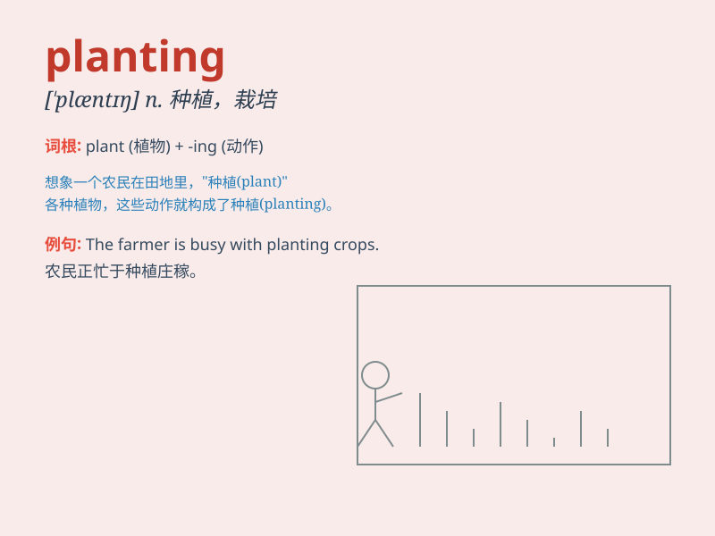

## planting

**英音:** _[\'plɑːntɪŋ]_ **美音:** _[\'plæntɪŋ]_

**译义:** *n.种植,栽培,装备*

### 短语

+ **tree planting:** _植树_

+ **planting season:** _种植季节_

+ **planting area:** _种植面积_

+ **planting density:** _种植密度_

+ **planting method:** _种植方法_

### 例句

#### 例句1

> **The planting of these trees will help improve the
environment.**

**中文翻译:** 种植这些树将有助于改善环境。

**单词释义:** 种植

#### 例句2

> **She is busy with the planting of flowers in her garden.**

**中文翻译:** 她正忙于在她的花园里种花。

**单词释义:** 栽种

#### 例句3

> **The success of the crop depends on the proper planting.**

**中文翻译:** 农作物的成功取决于恰当的种植。

**单词释义:** 种植（方式）

### 背诵小故事

> One sunny day, Tom went to the farm. He saw many workers busy with
planting. They put seeds into the soil carefully, hoping for a rich
harvest in the future. Tom learned that planting is the start of a
wonderful journey to get delicious fruits and grains.

**在一个阳光明媚的日子，汤姆去了农场。他看到许多工人正忙着种植。他们小心地把种子放进土里，期望未来有个大丰收。汤姆了解到种植是获得美味水果和谷物的美妙旅程的开始。**

### 图义

