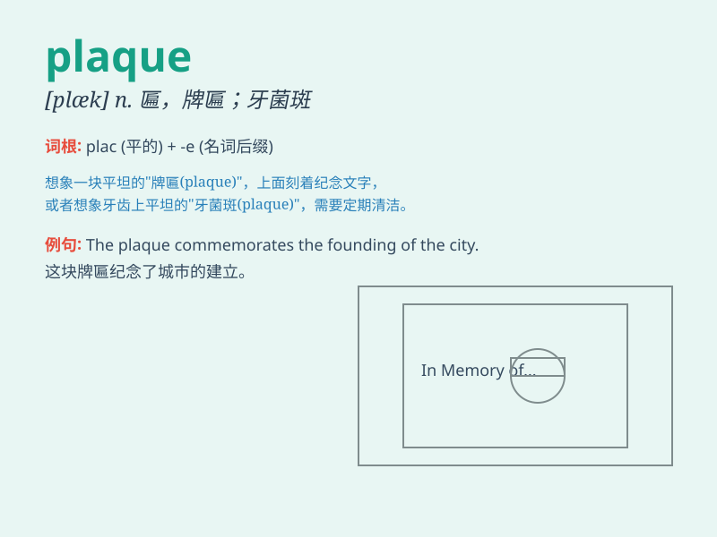

## plaque

**英音:** _[plæk; plɑːk]_ **美音:** _[plæk]_

**译义:** *n.装在墙上作装饰或纪念用的薄金属板或瓷片*

### 短语

+ **atherosclerotic plaque:** _动脉粥样硬化斑块_

+ **dental plaque:** _牙菌斑_

+ **plaques on the wall:** _墙上的饰板_

+ **honorary plaque:** _荣誉牌匾_

+ **memorial plaque:** _纪念牌匾_

### 例句

#### 例句1

> **The dentist removed the plaque from my teeth.**

**中文翻译:** 牙医清除了我牙齿上的牙斑。

**单词释义:** 牙斑；齿菌斑

#### 例句2

> **There was a plaque on the wall commemorating the event.**

**中文翻译:** 墙上有一块纪念该事件的牌匾。

**单词释义:** 牌匾；纪念匾

#### 例句3

> **The build-up of plaque in the arteries can lead to heart
disease.**

**中文翻译:** 动脉中斑块的积聚可能导致心脏病。

**单词释义:** （血管等的）斑块

### 背诵小故事

> One day, a scientist was studying a strange substance on a wall. He
called it \'plaque\'. It looked like a hard layer, and he found it was
related to bacteria. Later, he discovered ways to clean and prevent this
plaque.

**有一天，一位科学家正在研究墙上的一种奇怪物质。他称其为"牌匾；牙斑"。它看起来像一层硬壳，并且他发现它与细菌有关。后来，他找到了清洁和预防这种牙斑的方法。**

### 图义

