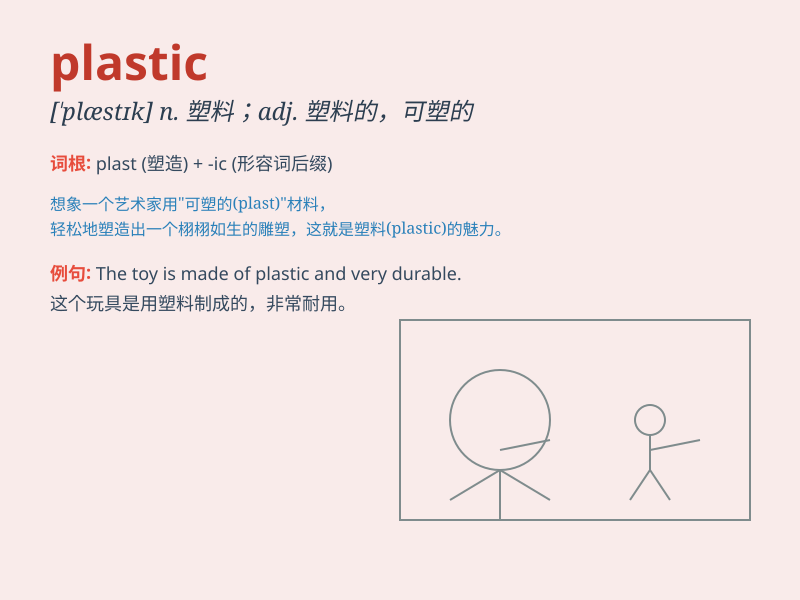

## plastic

**英音:** _[\'plæstɪk]_ **美音:** _[\'plæstɪk]_

**译义:**
*n.塑胶,可塑体,塑料制品,整形adj.塑胶的,塑造的,有可塑性的,造形的,(外科)整形的*

### 短语

+ **plastic bag:** _塑料袋_

+ **plastic surgery:** _整形手术_

+ **plastic wrap:** _塑料包装膜_

+ **plastic bottle:** _塑料瓶_

+ **plastic material:** _塑料材料_

### 例句

#### 例句1

> **The chair is made of plastic.**

**中文翻译:** 这把椅子是由塑料制成的。

**单词释义:** 塑料

#### 例句2

> **She had plastic surgery to improve her appearance.**

**中文翻译:** 她做了整形手术来改善外貌。

**单词释义:** 整形的；可塑的

#### 例句3

> **The credit card is a form of plastic money.**

**中文翻译:** 信用卡是一种塑料货币。

**单词释义:** 塑料制的

### 背诵小故事

> One day, I went to a store and saw a beautiful plastic flower. It
looked so real but wasn\'t natural. I realized that \'plastic\' can be
used to describe something artificial and not genuine, like that flower.

**有一天，我去一家商店，看到了一朵漂亮的塑料花。它看起来很逼真但不是天然的。我意识到\'plastic\'这个词可以用来形容像那朵花一样人造的、不真实的东西。**

### 图义

