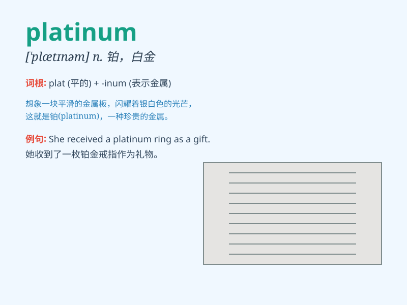

## platinum

**英音:** _[\'plætɪnəm]_ **美音:** _[\'plætnəm]_

**译义:** *n.白金,铂*

### 短语

+ **platinum blonde:** _淡金黄色头发的（女子）_

+ **platinum record:** _白金唱片_

+ **platinum card:** _白金卡_

+ **platinum jewelry:** _白金首饰_

+ **platinum electrode:** _铂电极_

### 例句

#### 例句1

> **The ring is made of platinum and is very expensive.**

**中文翻译:** 这枚戒指是由铂金制成的，非常昂贵。

**单词释义:** 铂金

#### 例句2

> **She received a platinum record for her outstanding music
sales.**

**中文翻译:** 她因其出色的音乐销量获得了一张白金唱片。

**单词释义:** 白金（指唱片销售量）

#### 例句3

> **The platinum card offers exclusive benefits and privileges.**

**中文翻译:** 这张白金卡提供专属的福利和特权。

**单词释义:** 白金（指信用卡级别）

### 背诵小故事

>
想象一下，一位勇敢的探险家在深山中寻找宝藏，最终发现了一种极其稀有、闪耀着独特光芒的金属，它就是
platinum（白金），因其珍贵和独特，成为了众人追捧的宝贝。

**想象一下，一位勇敢的探险家在深山中寻找宝藏，最终发现了一种极其稀有、闪耀着独特光芒的金属，它就是白金，因其珍贵和独特，成为了众人追捧的宝贝。**

### 图义

