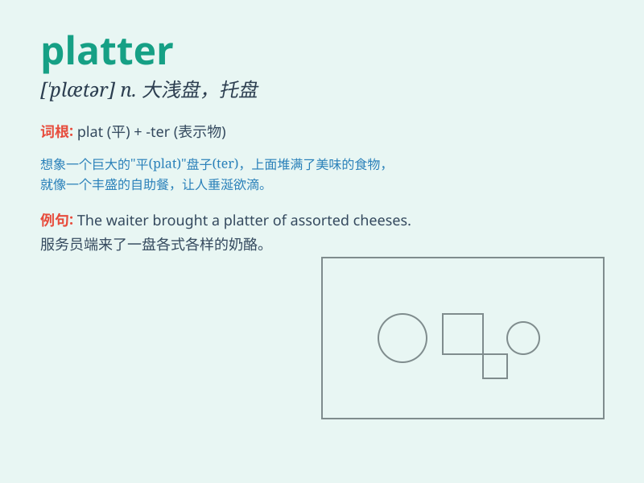

## platter

**英音:** _[\'plætə]_ **美音:** _[\'plætɚ]_

**译义:** *n.大浅盘*

### 短语

+ **meat platter:** _肉盘_

+ **fruit platter:** _水果拼盘_

+ **cheese platter:** _奶酪盘_

+ **seafood platter:** _海鲜拼盘_

+ **vegetable platter:** _蔬菜拼盘_

### 例句

#### 例句1

> **The waitress brought a platter of fresh fruits to the table.**

**中文翻译:** 女服务员把一盘新鲜水果端到了桌子上。

**单词释义:** 大浅盘；一盘食物

#### 例句2

> **He placed the hamburgers on a platter for the guests.**

**中文翻译:** 他把汉堡包放在一个大盘子里给客人们。

**单词释义:** 大浅盘；一盘食物

#### 例句3

> **The platter was decorated with beautiful patterns.**

**中文翻译:** 这个盘子装饰着漂亮的图案。

**单词释义:** 大浅盘

### 背诵小故事

> Once upon a time, at a big party, a waiter carried a huge platter
filled with delicious fruits. Everyone was attracted by the platter. It
was like a magic plate bringing joy.

**从前，在一个盛大的聚会上，一个服务员端着一个巨大的盘子，里面装满了美味的水果。每个人都被这个大浅盘吸引。它就像一个带来欢乐的神奇盘子。**

### 图义

