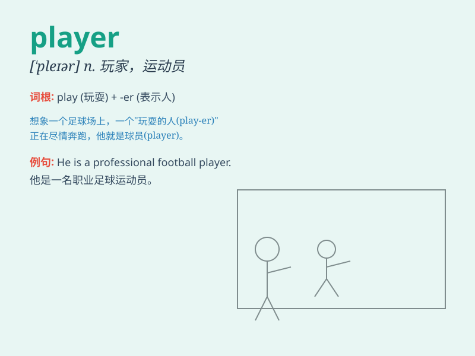

## player

**英音:** _[\'pleɪə]_ **美音:** _[\'pleɚ]_

**译义:** *n.做游戏的人,比赛者,演员,演奏者,表演者*

### 短语

+ **football player:** _足球运动员_

+ **basketball player:** _篮球运动员_

+ **team player:** _有团队合作精神的人_

+ **key player:** _关键球员；核心人物_

+ **star player:** _明星球员_

### 例句

#### 例句1

> **The basketball player is very tall and skilled.**

**中文翻译:** 这位篮球运动员非常高大且技术娴熟。

**单词释义:** 运动员

#### 例句2

> **She is a famous piano player.**

**中文翻译:** 她是一位著名的钢琴演奏者。

**单词释义:** 演奏者

#### 例句3

> **The team needs a strong player to win the game.**

**中文翻译:** 这个团队需要一个强大的选手来赢得比赛。

**单词释义:** 选手

### 背诵小故事

> One day, in a big game, a talented person named Tom was the key
player. He showed amazing skills and led the team to victory. Everyone
cheered for this outstanding player.

**有一天，在一场大型比赛中，一个叫汤姆的有才华的人是关键球员。他展示了惊人的技能，并带领团队取得胜利。每个人都为这位杰出的球员欢呼。**

### 图义

