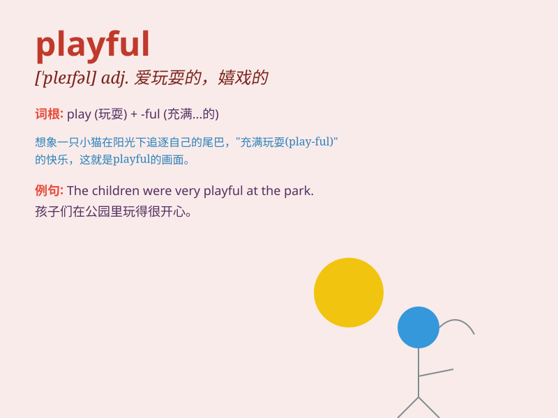

## playful

**英音:** _[\'pleɪfʊl; -f(ə)l]_ **美音:** _[\'plefl]_

**译义:** *adj.好玩的,嬉戏的,十分有趣的,顽皮的*

### 短语

+ **playful kitten:** _顽皮的小猫_

+ **playful mood:** _欢快的心情_

+ **playful child:** _顽皮的孩子_

+ **playful banter:** _俏皮的玩笑_

+ **playful spirit:** _嬉戏的精神_

### 例句

#### 例句1

> **The puppy was very playful and kept chasing its tail.**

**中文翻译:** 这只小狗非常顽皮，一直追着自己的尾巴跑。

**单词释义:** 顽皮的，爱玩闹的

#### 例句2

> **She has a playful nature and loves to joke around.**

**中文翻译:** 她天性活泼，喜欢开玩笑。

**单词释义:** 活泼的，爱嬉戏的

#### 例句3

> **The children had a playful afternoon at the park.**

**中文翻译:** 孩子们在公园度过了一个充满欢乐嬉戏的下午。

**单词释义:** 嬉戏的，娱乐的

### 背诵小故事

> One day, I saw a monkey in the zoo. It was very playful. It jumped
around, played with toys, and made funny faces. Its playful behavior
made everyone laugh.

**有一天，我在动物园看到一只猴子。它非常顽皮。它到处跳，玩玩具，还做鬼脸。它顽皮的行为让每个人都大笑。**

### 图义

