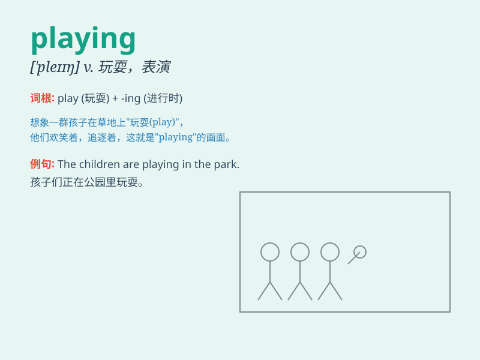

## playing

**英音:** _[\'pleɪɪŋ]_ **美音:** _[\'pleɪɪŋ]_

**译义:**
*v.玩，玩耍；打（游戏），参加（体育活动）；播放，演出；上演；n.游戏，玩耍；比赛，竞赛*

### 短语

+ **playing football:** _踢足球_

+ **playing the piano:** _弹钢琴_

+ **playing games:** _玩游戏_

+ **playing tennis:** _打网球_

+ **playing basketball:** _打篮球_

### 例句

#### 例句1

> **I enjoy playing basketball on weekends.**

**中文翻译:** 我喜欢在周末打篮球。

**单词释义:** 玩耍；进行（某种球类运动）

#### 例句2

> **The children are playing in the park.**

**中文翻译:** 孩子们正在公园里玩。

**单词释义:** 玩耍；嬉戏

#### 例句3

> **She is playing the piano beautifully.**

**中文翻译:** 她正在优美地弹钢琴。

**单词释义:** 演奏

### 背诵小故事

> One sunny day, I saw a group of children playing happily in the park.
They were playing various games like hide-and-seek and tag. The scene
was full of joy and laughter.

**在一个阳光明媚的日子，我看到一群孩子在公园里开心地玩耍。他们在玩各种游戏，比如捉迷藏和追逐游戏。这个场景充满了欢乐和笑声。**

### 图义

