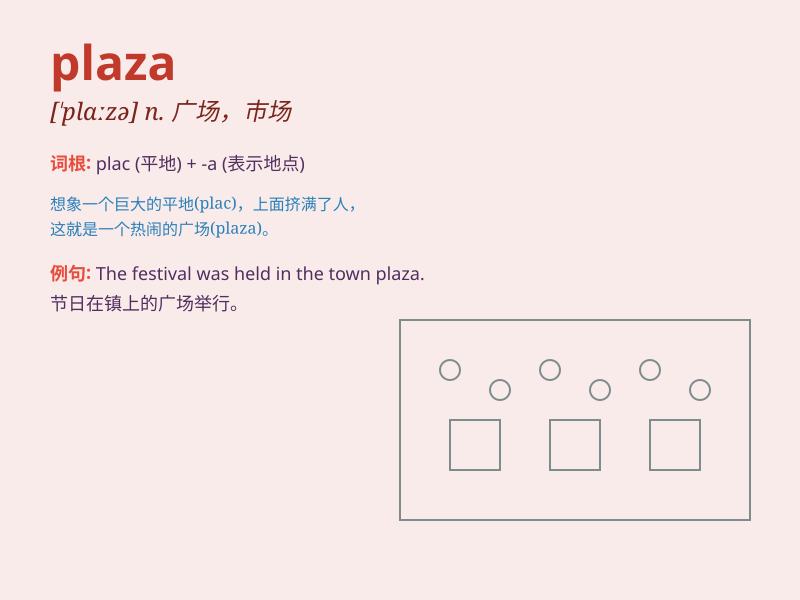

## plaza

**英音:** _[\'plɑːzə]_ **美音:** _[\'plæzə]_

**译义:** *n.广场,露天汽车停车场,购物中心*

### 短语

+ **shopping plaza:** _购物广场_

+ **city plaza:** _城市广场_

+ **commercial plaza:** _商业广场_

+ **plaza hotel:** _广场酒店_

+ **central plaza:** _中央广场_

### 例句

#### 例句1

> **The new shopping plaza is very crowded on weekends.**

**中文翻译:** 新的购物广场在周末非常拥挤。

**单词释义:** 广场

#### 例句2

> **They met at the plaza in front of the city hall.**

**中文翻译:** 他们在市政厅前面的广场上见面。

**单词释义:** 广场

#### 例句3

> **The plaza was decorated with colorful lights for the
festival.**

**中文翻译:** 这个广场为节日装饰了五颜六色的灯。

**单词释义:** 广场

### 背诵小故事

> A young artist was lost in a big city. When tired, he found a
beautiful PLAZA. There were fountains and people having fun. He sat
there, inspired and decided to paint the scene. The PLAZA became his
source of creativity.

**一位年轻的艺术家在大城市里迷路了。当他疲惫时，发现了一个美丽的广场。那里有喷泉，人们在愉快地玩耍。他坐在那里，受到启发并决定画下这一幕。这个广场成为了他的创作源泉。**

### 图义

